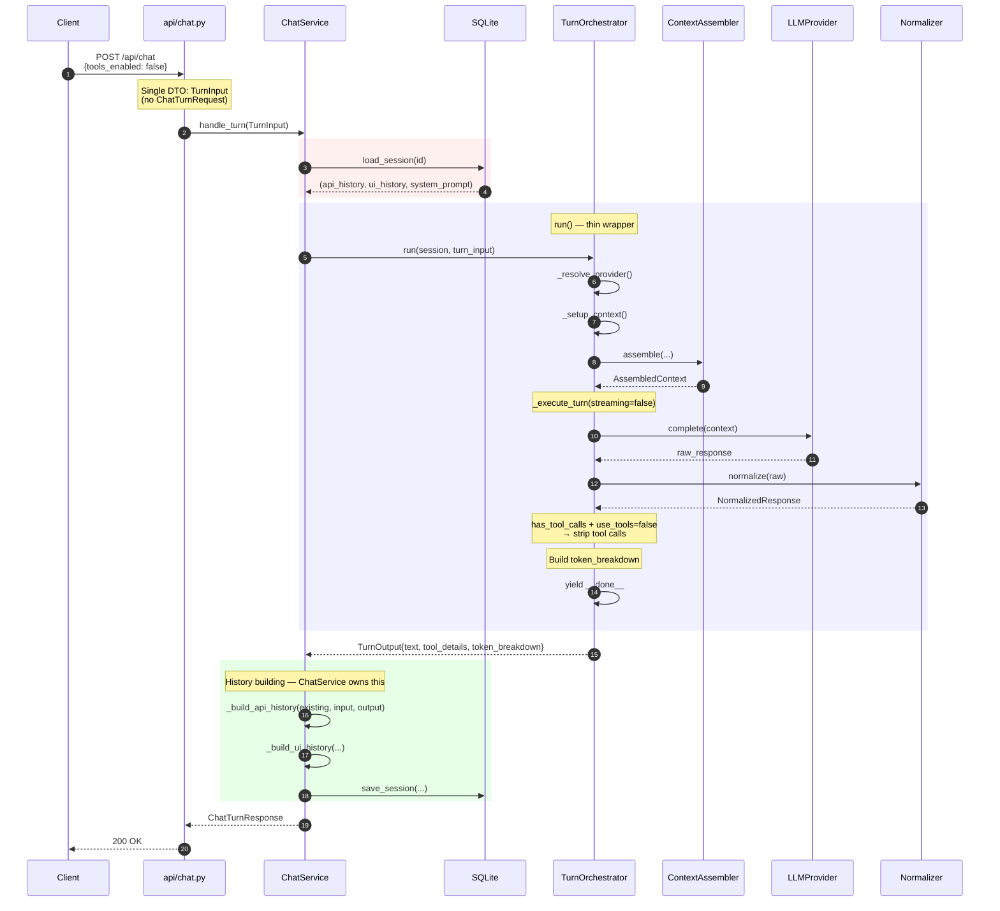
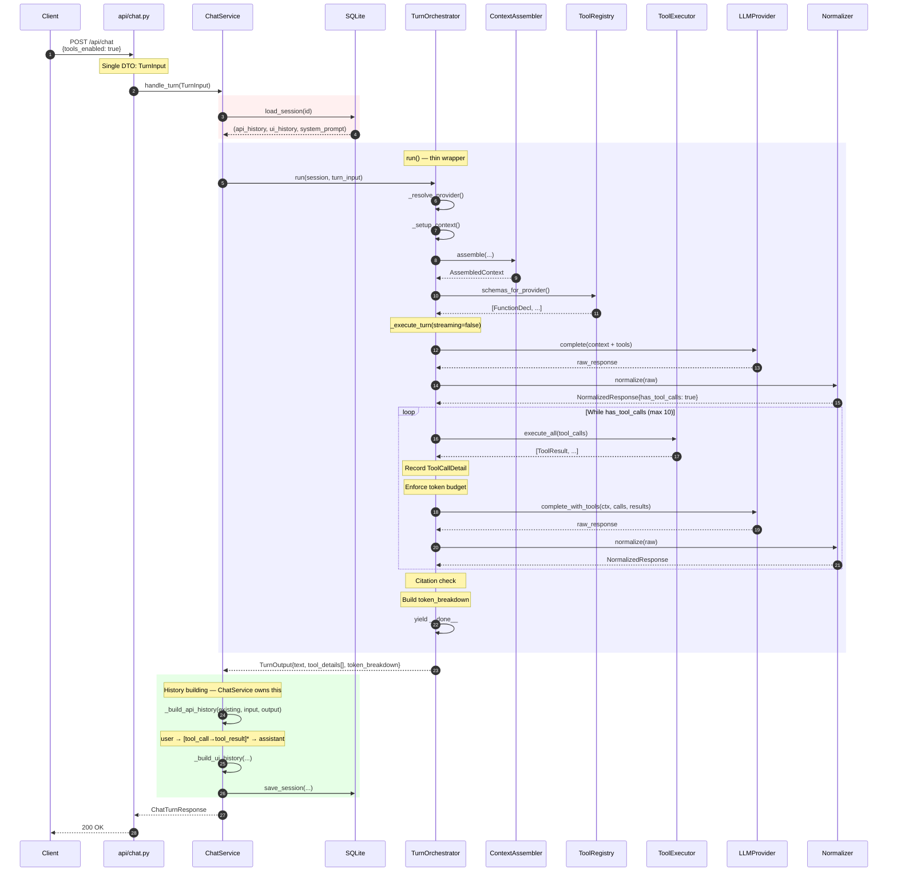
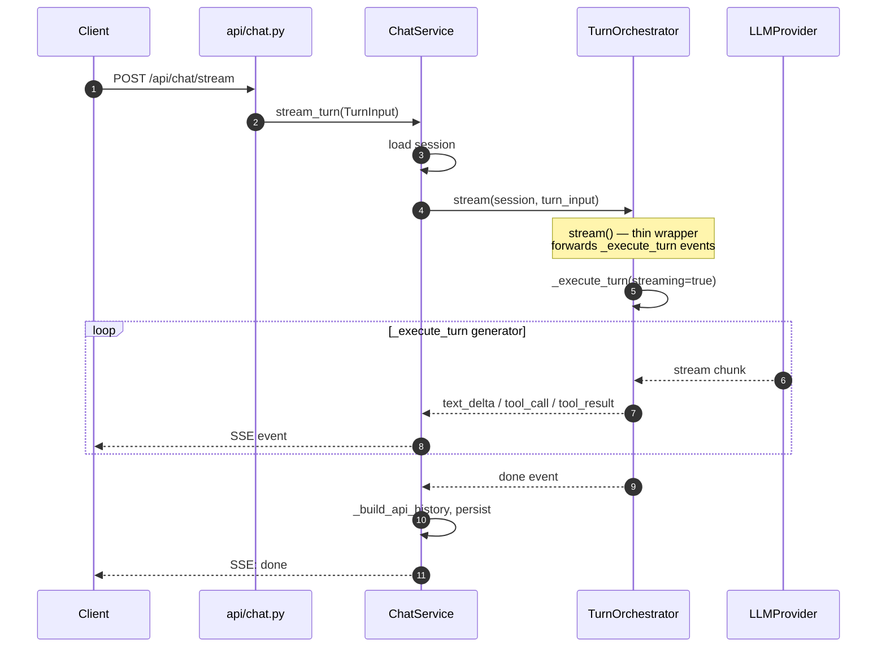

# Sequence Diagrams — After Refactoring

## Tools Disabled



## Tools Enabled



## Streaming (same _execute_turn, streaming=true)



## Responsibility Map

```
TurnOrchestrator (832 lines → ~250 lines of logic)
├── _resolve_provider()          — 12 lines
├── _setup_context()             — 20 lines
├── _execute_turn()              — 100 lines (THE core, shared by run/stream)
├── _force_text_response()       — 30 lines
├── run()                        — 25 lines (thin wrapper)
├── stream()                     — 30 lines (thin wrapper)
├── _stream_and_collect()        — 30 lines
├── _stream_and_collect_with_tools() — 30 lines
├── _execute_tool_calls()        — existing helper
├── _count_and_truncate()        — existing helper
├── _check_citation_compliance() — existing helper
└── NO history building          ✅ moved to ChatService
└── NO DTO transformation        ✅ TurnInput used directly

ChatService
├── _load_session()              — load + hydrate from repo
├── _build_api_history()         — NEW: builds from TurnOutput raw facts
├── _build_ui_history()          — builds UI messages
├── _persist()                   — serialize + save
├── handle_turn(request: TurnInput)  — sync orchestrator
└── stream_turn(request: TurnInput)  — streaming orchestrator
```
