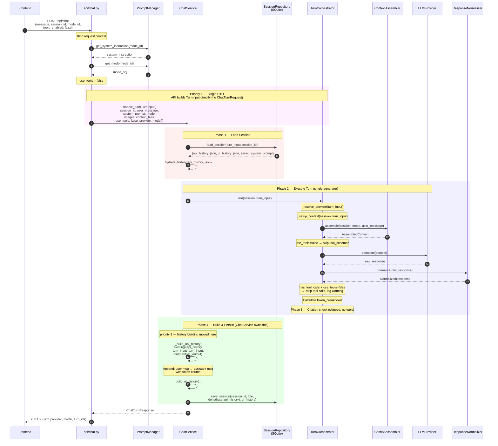

# Chat Turn — Refactored — Tools Disabled

## Changes from current architecture
- `ChatTurnRequest` **eliminated** — `TurnInput` is the single DTO (carries `session_id`)
- `TurnOutput` has `tool_details` instead of `updated_api_history` — **raw facts only**
- `ChatService` **owns history building** via `_build_api_history()`
- `TurnOrchestrator._execute_turn()` is a **single generator** — `run()` and `stream()` are thin wrappers

### What changed vs. current

| Aspect | Before | After |
|---|---|---|
| **DTO chain** | `ChatRequest → ChatTurnRequest → TurnInput` | `ChatRequest → TurnInput` |
| **History built by** | `TurnOrchestrator.run()` | `ChatService._build_api_history()` |
| **TurnOutput** | contains `updated_api_history` | contains `tool_details` (raw facts) |
| **run()/stream()** | two separate ~250-line methods | thin wrappers over `_execute_turn()` |
