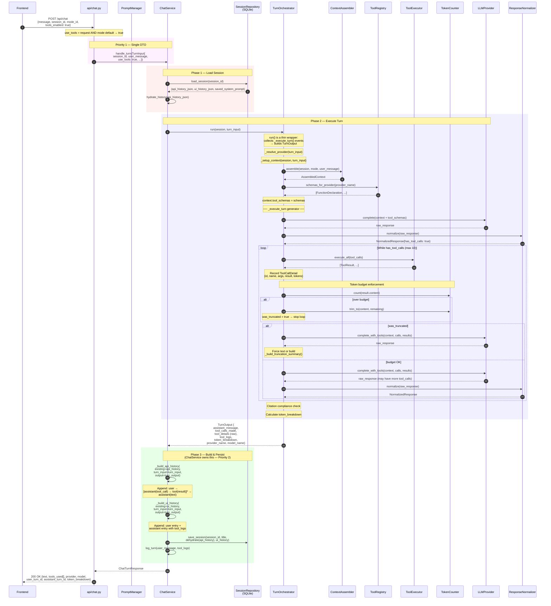
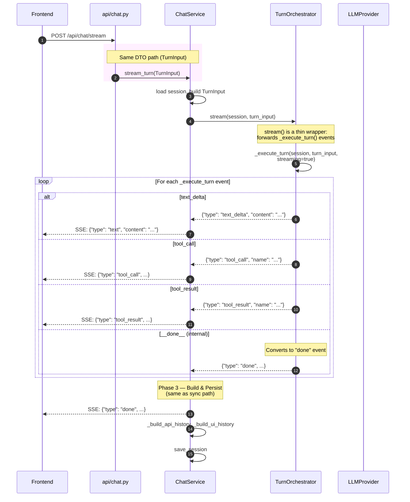

# Chat Turn — Refactored — Tools Enabled

## Architecture changes (same as tools-disabled diagram)
1. `ChatTurnRequest` eliminated — `TurnInput` is single DTO
2. `TurnOutput` returns raw `tool_details`, NOT `updated_api_history`
3. `ChatService` owns history building
4. `TurnOrchestrator._execute_turn()` is unified generator



## Streaming path (Priority 3 — same `_execute_turn()`)



## What the unified `_execute_turn()` looks like

```
_execute_turn(session, turn_input, *, streaming=False):

    # ── Setup (shared) ──────────────────────────────────────────
    provider, provider_name = _resolve_provider(turn_input)
    context = _setup_context(session, turn_input)

    # ── Initial LLM call ────────────────────────────────────────
    if streaming:
        for event in _stream_llm(context, provider, provider_name):
            if event is __normalized__: normalized = event.response
            else: yield event          # text_delta to caller
    else:
        raw = provider.complete(context)
        normalized = normalizer.normalize(raw)

    # ── Tool loop (shared structure) ────────────────────────────
    while normalized.has_tool_calls and use_tools:
        iterations += 1; guard max_iterations

        calls, results = _execute_tool_calls(normalized, tool_details)
        results, was_truncated = _enforce_budget(results, ...)

        for tc, tr in zip(calls, results):
            yield {"type": "tool_call", ...}
            yield {"type": "tool_result", ...}

        if was_truncated:
            # force text response
            break

        if streaming:
            for event in _stream_llm_with_tools(context, calls, results, ...):
                if event is __normalized__: normalized = event.response
                else: yield event
        else:
            raw = provider.complete_with_tools(context, calls, results)
            normalized = normalizer.normalize(raw)

    # ── Done signal ─────────────────────────────────────────────
    yield {"type": "__done__", "text": ..., "tool_details": ..., ...}
```

## Responsibility map after refactoring

```
┌─────────────────────────────────────────────────────────────────┐
│ TurnOrchestrator                                                │
│  ✅ _resolve_provider()     — provider override vs default      │
│  ✅ _setup_context()        — assemble + inject tool schemas    │
│  ✅ _execute_turn()         — unified generator (the real work) │
│  ✅ run()                   — thin wrapper: collect events       │
│  ✅ stream()                — thin wrapper: forward events       │
│  ✅ _execute_tool_calls()   — tool dispatch + detail recording   │
│  ✅ _enforce_budget()       — token budget for tool results      │
│  ✅ _check_citation_compliance() — quality check (log only)      │
│                                                                 │
│  ❌ NO history building     — moved to ChatService               │
│  ❌ NO session persistence  — already in ChatService             │
│  ❌ NO DTO transformation   — TurnInput used directly            │
└─────────────────────────────────────────────────────────────────┘

┌─────────────────────────────────────────────────────────────────┐
│ ChatService                                                     │
│  ✅ _load_session()         — load + hydrate from repo           │
│  ✅ _build_api_history()    — NEW: builds from TurnOutput raw    │
│  ✅ _build_ui_history()     — builds UI messages                  │
│  ✅ _persist()              — serialize + save + log              │
│  ✅ handle_turn()           — sync path orchestrator              │
│  ✅ stream_turn()           — streaming path orchestrator         │
│                                                                 │
│  ❌ NO DTO transformation   — takes TurnInput directly           │
│  ❌ NO _build_turn_input()  — eliminated                         │
└─────────────────────────────────────────────────────────────────┘
```
