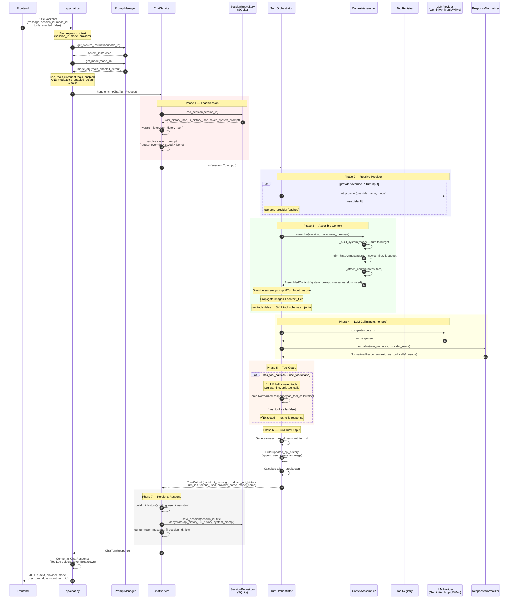

# Chat Turn — Tools Disabled

### Key Points (No Tools)

| Aspect | Behavior |
|---|---|
| **LLM calls** | Exactly 1 — `provider.complete(context)` |
| **Tool schemas** | Not injected into context (`tool_schemas=None`) |
| **Hallucinated tools** | Detected and stripped with warning log |
| **Token budget** | Only system prompt + history + content slots |
| **History** | `user → assistant` (2 messages appended) |
| **Latency** | Single LLM round-trip |
