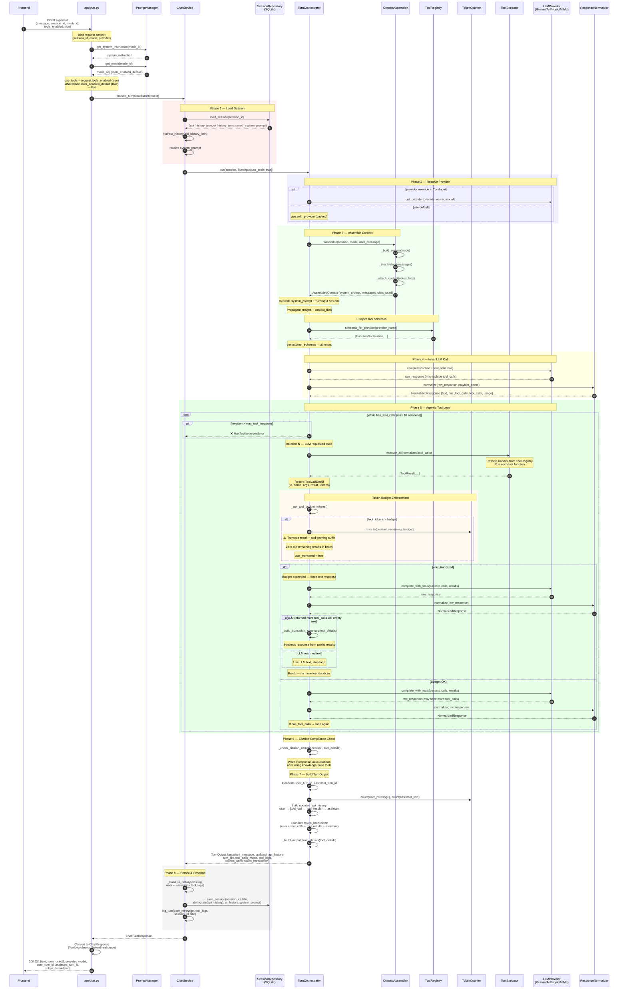

# Chat Turn — Tools Enabled



### Key Points (With Tools)

| Aspect | Behavior |
|---|---|
| **LLM calls** | 1 + N (where N = tool iterations, max 10) |
| **Tool schemas** | Injected from `ToolRegistry.schemas_for_provider()` |
| **Tool loop** | `complete → execute → complete_with_tools → normalize → repeat` |
| **Token budget** | Per-slot: system prompt, history, notes, files, tool results |
| **Budget exceeded** | Truncate + force text response from partial results |
| **Citation check** | Warns if response lacks `## Źródła` / `[1]` markers after tool use |
| **History** | `user → [tool_call → tool_result]* → assistant` (variable length) |
| **Latency** | Multiple LLM round-trips (1 + N iterations) |

### Tool Loop Detail

```
Iteration 1:  LLM → tool_calls(read_file, search_kb)
              ↓
              ToolExecutor.run(read_file) → file content
              ToolExecutor.run(search_kb) → search results
              ↓
              Check token budget (truncate if needed)
              ↓
              LLM → tool_calls(read_file) or text

Iteration 2:  LLM → tool_calls(read_file)
              ↓
              ToolExecutor.run(read_file) → file content
              ↓
              LLM → text (final answer)

...up to max 10 iterations
```
