# Kitchen Agent — Architecture Diagrams

Mermaid diagrams documenting the system architecture. Render in GitHub,
GitLab, Obsidian, or any Mermaid-compatible Markdown viewer.

---

## 1. High-Level Architecture Overview

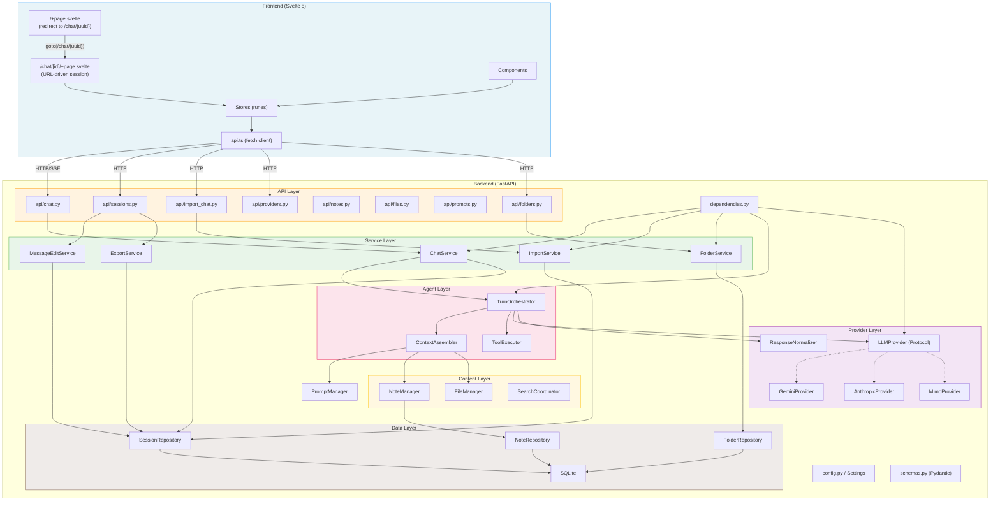

---

## 2. Provider System

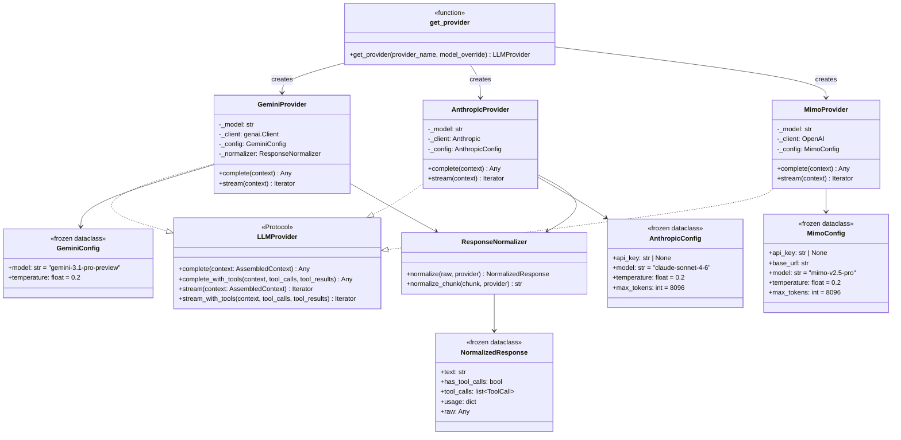

---

## 3. Agent Layer — Turn Lifecycle

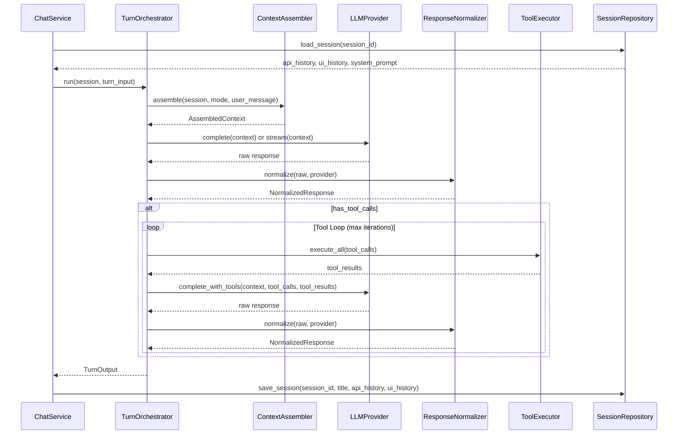

---

## 4. Chat Request Data Flow

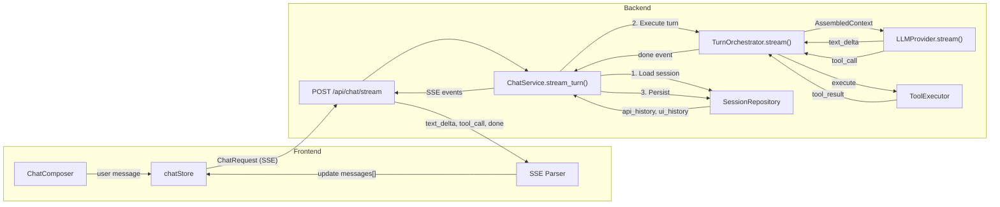

---

## 5. Frontend Store Topology

```mermaid
graph TB
    subgraph Stores["Svelte 5 Rune Stores — 8 focused stores"]
        ChatStore["chatStore<br/><i>chat.svelte.ts</i><br/>session, messaging"]
        ProviderStore["providerStore<br/><i>provider.svelte.ts</i><br/>provider/model, app info"]
        PromptStore["promptStore<br/><i>prompt.svelte.ts</i><br/>modes, tools"]
        EditorStore["editorStore<br/><i>editor.svelte.ts</i><br/>message & prompt editing"]
        TokenStore["tokenStore<br/><i>token.svelte.ts</i><br/>token counting"]
        FolderStore["folderStore (class-based)<br/><i>folder.svelte.ts</i><br/>folders, session cache, drag-drop, pendingOps"]
        SessionStore["sessionStore<br/><i>sessions.svelte.ts</i>"]
        NotesStore["notesStore<br/><i>notes.svelte.ts</i>"]
    end

    subgraph ChatState["chatStore owns (core only)"]
        CS_Session["sessionId, messages"]
        CS_Async["chatState (AsyncState)"]
        CS_Images["pastedImages"]
        CS_Context["contextFiles"]
    end

    subgraph ProviderState["providerStore owns"]
        PS_Providers["providers (catalog)"]
        PS_Selected["selectedProvider, selectedModel"]
        PS_App["appTitle, appDescription"]
    end

    subgraph PromptState["promptStore owns"]
        PR_Mode["selectedModeId, modesState"]
        PR_Tools["toolsEnabled"]
        PR_Inspector["promptDetail*, inspectorOpen"]
    end

    subgraph EditorState["editorStore owns"]
        ES_Edit["editingTurnId, editDraft, editState"]
        ES_System["sessionSystemPrompt (loaded on session switch)"]
    end

    subgraph TokenState["tokenStore owns"]
        TS_Count["sessionTokenCount, fallback"]
        TS_Cache["contextFileTokenEstimate, systemPromptText"]
    end

    subgraph SessionState["sessionStore owns"]
        SS_Tree["tree (SessionNode[])"]
        SS_Flat["flat (derived)"]
        SS_Active["activeId"]
    end

    subgraph FolderState["folderStore owns (class-based, SvelteMap/SvelteSet)"]
        FS_Folders["folders, sortedFolders (derived)"]
        FS_Sessions["folderSessions (SvelteMap)"]
        FS_Expanded["expandedFolders, folderedSessionIds (SvelteSet)"]
        FS_Drag["dragPayload, dropTarget"]
        FS_Pending["pendingOps (SvelteMap)"]
    end

    subgraph NotesState["notesStore owns"]
        NS_BySession["bySession (Record&lt;string, Note[]&gt;)"]
        NS_Fetch["fetchStates"]
    end

    subgraph Consumers["Component Consumers (Direct Imports)"]
        ChatPage["/chat/[id]/+page.svelte"]
        ComposerActions["ComposerActions"]
        ChatComposer["ChatComposer"]
        TokenIndicator["TokenIndicator"]
        SidebarLayout["SidebarLayout"]
        SessionPanel["SessionPanel"]
        ArchivedPanel["ArchivedPanel"]
        FolderTree["FolderTree"]
        FolderItem["FolderItem"]
        DraggableSession["DraggableSession"]
        NotePopup["NotePopup"]
        NotesPanel["NotesPanel"]
    end

    %% Direct imports — no facade pattern
    ChatPage -->|"loadSession, sendMessage"| ChatStore
    ChatPage -->|"providers, appTitle"| ProviderStore
    ChatPage -->|"selectedModeId, loadModes"| PromptStore
    ChatPage -->|"editState, startEditing"| EditorStore

    ComposerActions -->|"toolsEnabled, toggleTools"| PromptStore
    ChatComposer -->|"pastedImages, chatState"| ChatStore
    TokenIndicator -->|"sessionTokenCount"| TokenStore
    TokenIndicator -->|"contextWindowK"| ProviderStore

    SidebarLayout -->|"refresh"| FolderStore
    SessionPanel -->|"tree, activeId"| SessionStore
    ArchivedPanel -->|"tree, archived_at"| SessionStore
    FolderTree -->|"sortedFolders"| FolderStore
    FolderItem -->|"getSessions, pendingOps"| FolderStore
    DraggableSession -->|"startDrag, endDrag"| FolderStore

    NotePopup -->|"create, delete"| NotesStore
    NotesPanel -->|"forSession(), load()"| NotesStore

    style ChatStore fill:#e3f2fd,stroke:#1565C0
    style ProviderStore fill:#f3e5f5,stroke:#9C27B0
    style PromptStore fill:#fce4ec,stroke:#E91E63
    style EditorStore fill:#fff8e1,stroke:#FFC107
    style TokenStore fill:#e8f5e9,stroke:#2E7D32
    style FolderStore fill:#e8f5e9,stroke:#2E7D32
    style SessionStore fill:#e8f5e9,stroke:#2E7D32
    style NotesStore fill:#fff3e0,stroke:#E65100
```

---

## 6. Dependency Injection Graph

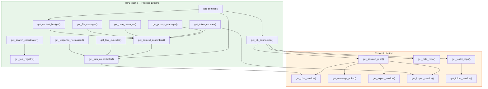

---

## 7. URL-Based Session Routing

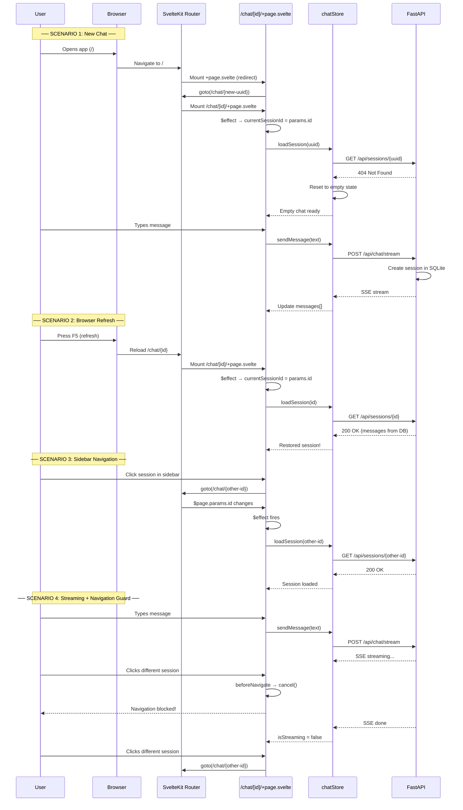

---

## 8. URL Routing State Machine

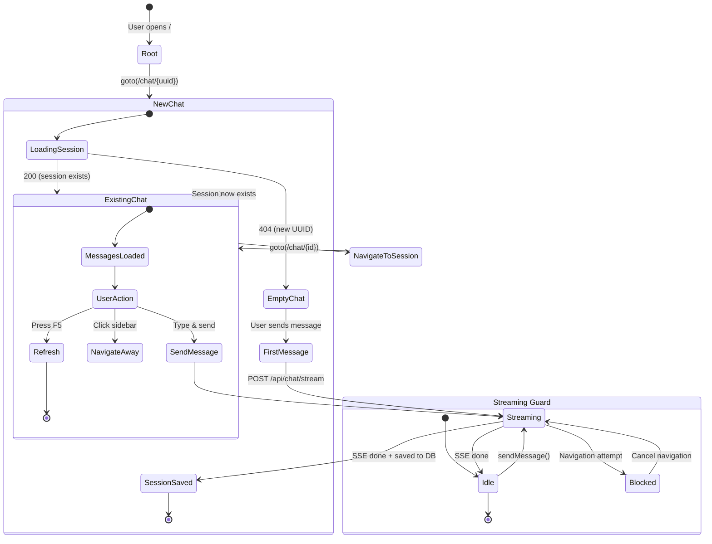

---

## 9. Title Generation Flow

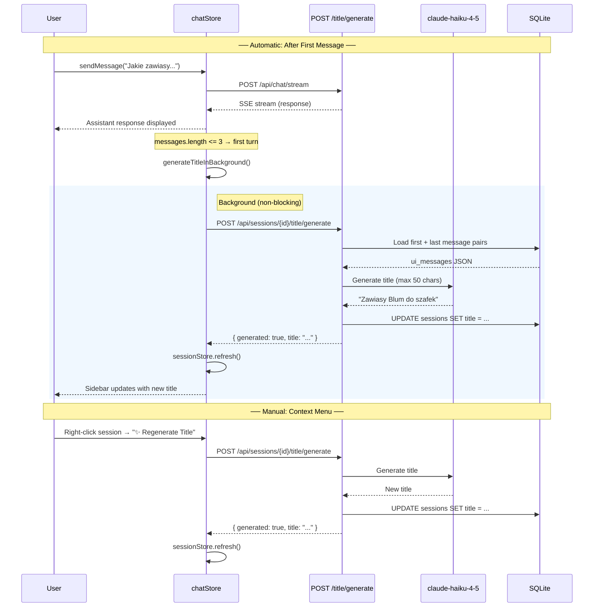

### Title Generation Prompt Structure

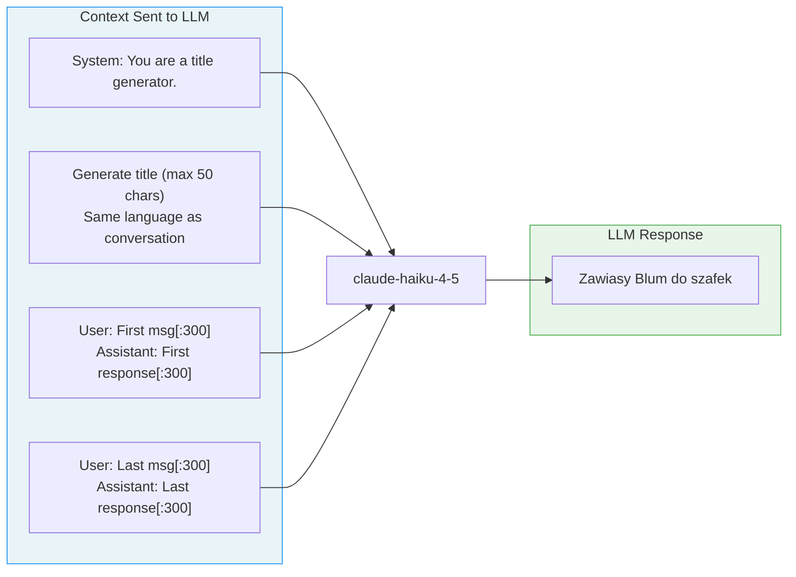

---

## 10. Token Indicator Architecture

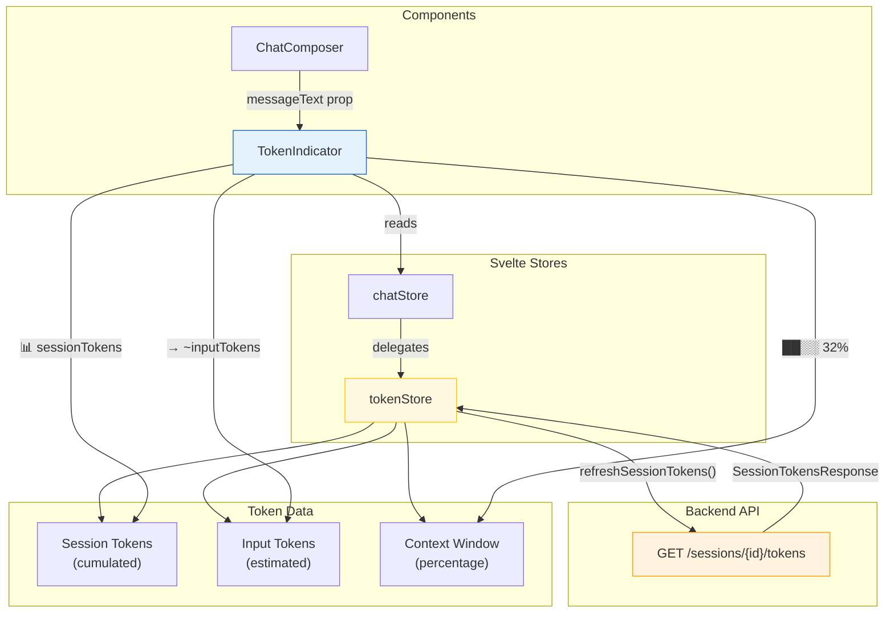

### Token Indicator Display

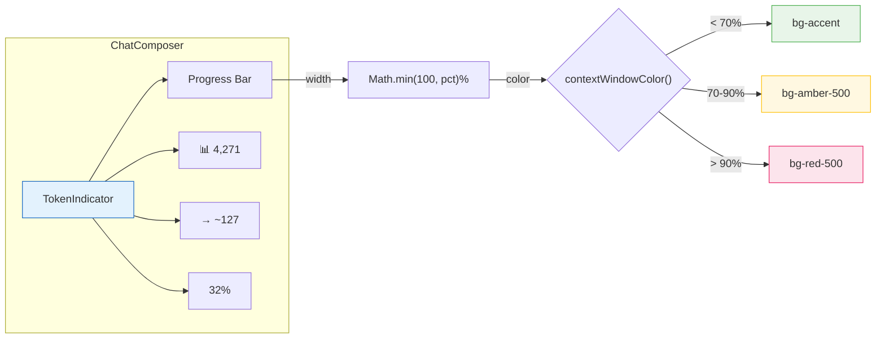

---

## 11. Session Title Lifecycle

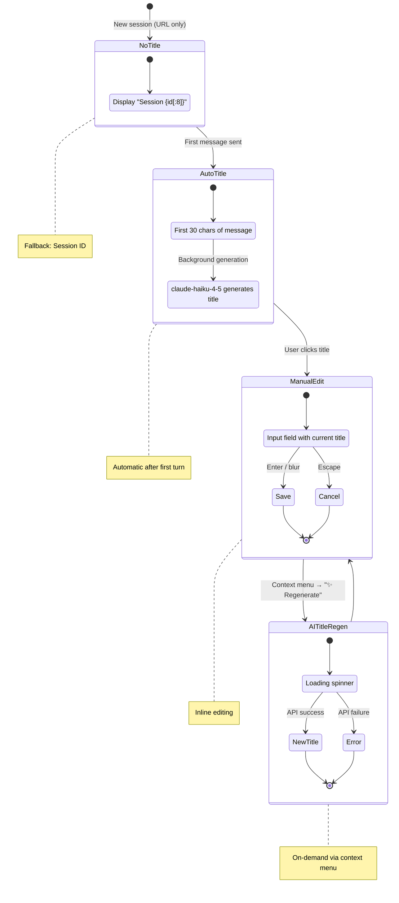

### Title Display Logic

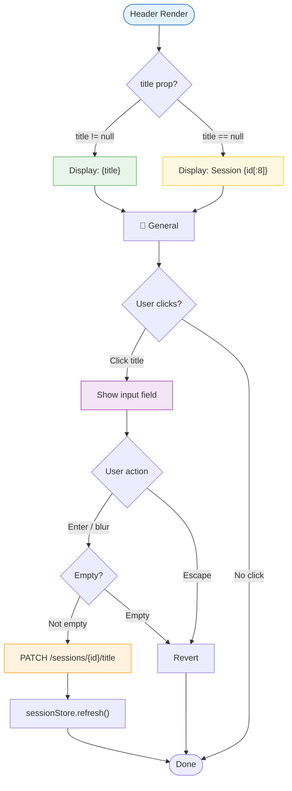

---

## 12. Import/Export Data Flow

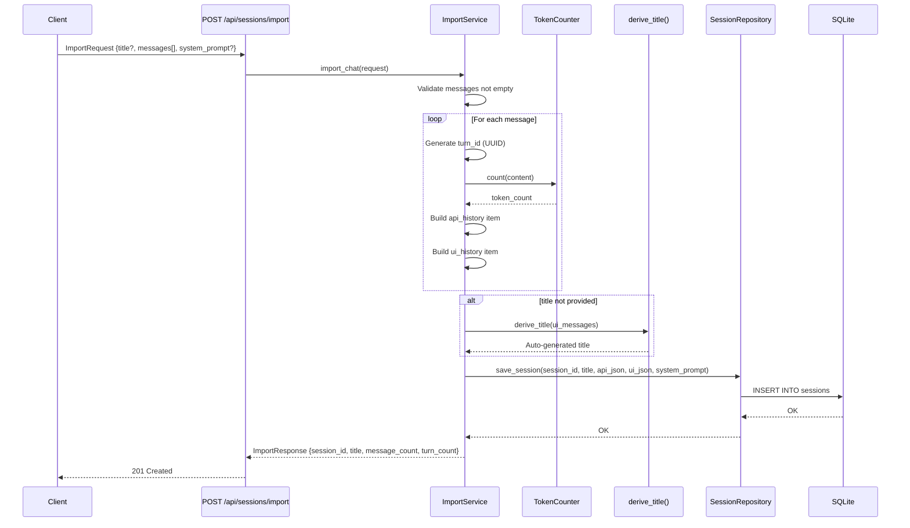

### Export Data Flow

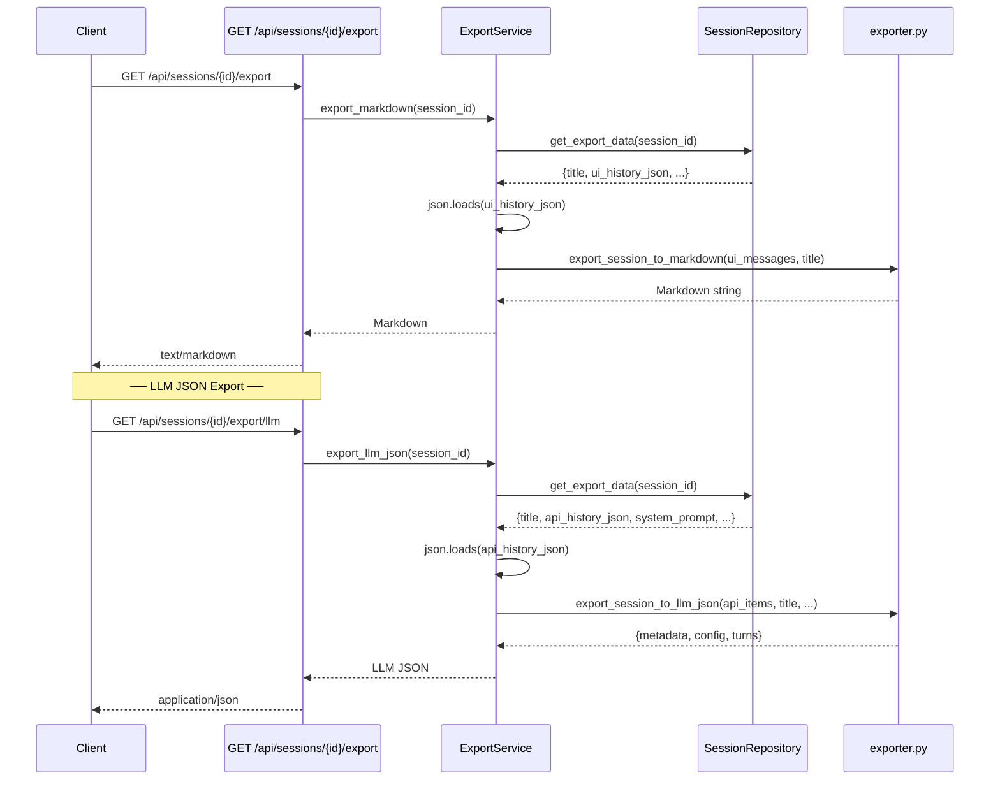

### Import/Export Architecture

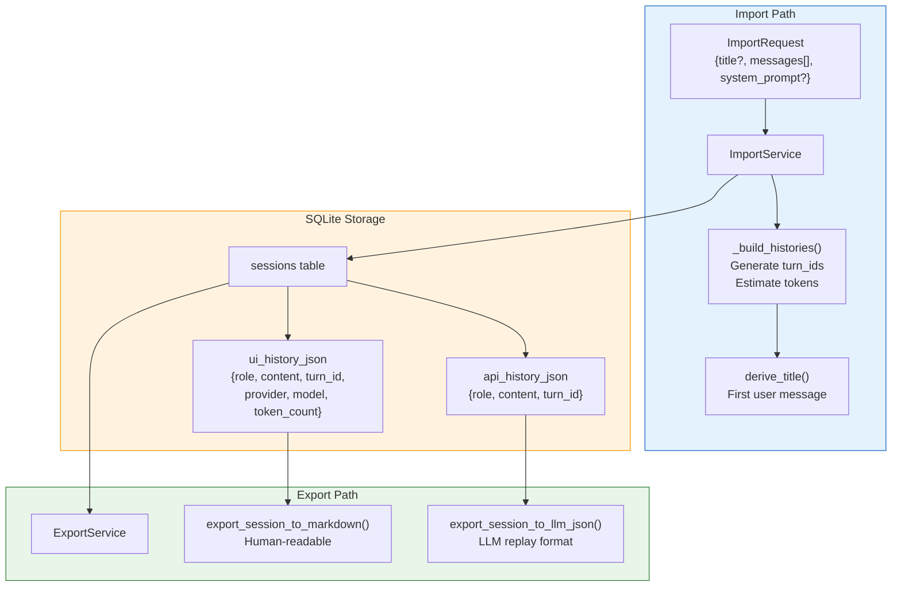

---

## Diagram Maintenance

When the architecture changes:

1. **Adding a new provider** → Update Diagram 2 (Provider System)
2. **Adding a new API endpoint** → Update Diagram 1 (High-Level) and Diagram 4 (Data Flow)
3. **Changing turn orchestration** → Update Diagram 3 (Agent Layer)
4. **Adding a new store** → Update Diagram 5 (Store Topology). All stores are imported directly by components. chatStore owns session state and coordinates cross-store operations.
5. **Adding a new DI dependency** → Update Diagram 6 (DI Graph)
6. **Changing routing/navigation** → Update Diagram 7 (URL Routing) and Diagram 8 (State Machine)
7. **Changing import/export** → Update Diagram 12 (Import/Export Data Flow) and docs/specs/f002-import-export.md
8. **Session state changes** → Update docs/specs/session-state-machine.md and session-states-flow.md

### Recent Changes

| Date       | Change                                                                       | Diagrams Updated       |
| ---------- | ---------------------------------------------------------------------------- | ---------------------- |
| 2026-06-17 | Session state machine: tree operations for History/Folder/Archive            | 1, 5, 10 (updated)     |
| 2026-06-17 | DOM access timing fixes: waitForTimeout removal, proper waiting patterns     | - (E2E tests)          |
| 2026-06-17 | Refactor v2 complete: direct imports, Dialog, SidebarLayout, ComposerActions | 1, 5, 10 (updated)     |
| 2026-06-16 | Class-based folderStore, drag-drop bug fix, ModelSelector extraction         | 1, 5, 6 (updated)      |
| 2026-06-14 | Import chats from external JSON (POST /api/sessions/import)                  | 1, 6, 12 (new)         |
| 2026-06-14 | Shared title derivation (src/title_generator.py)                             | 9 (updated)            |
| 2026-06-12 | URL-based session routing (`/chat/[id]`)                                     | 1, 5, 7 (new), 8 (new) |
| 2026-06-12 | TokenIndicator in ChatComposer                                               | 5, 10 (new)            |
| 2026-06-12 | Session title display & inline editing                                       | 11 (new)               |
| 2026-06-12 | AI title regeneration (POST /title/generate)                                 | 9 (new), 11 (new)      |
| 2026-06-12 | Auto-generate title on first message                                         | 9 (updated)            |
