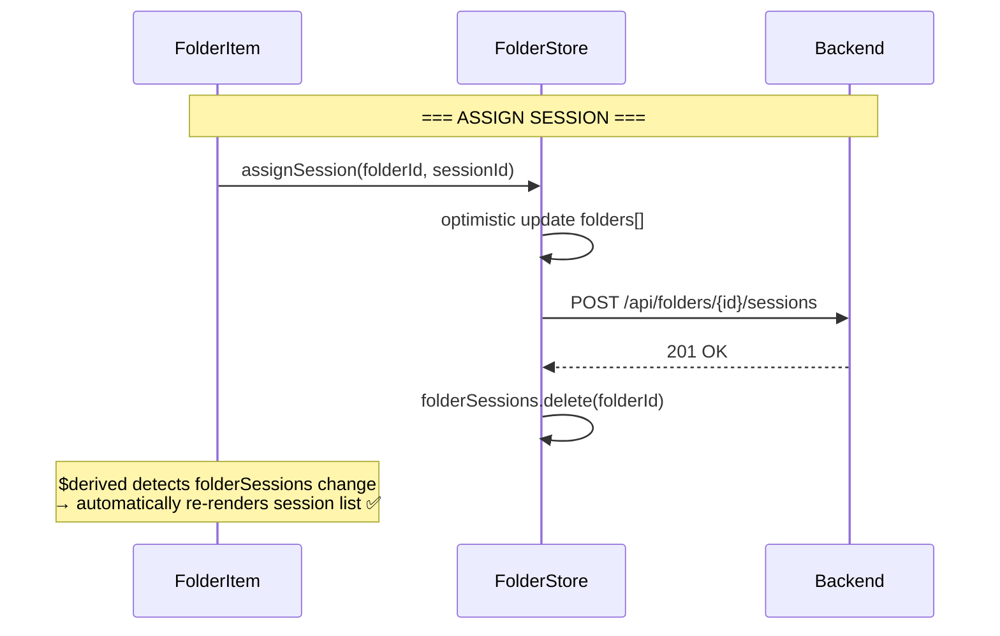

# Drag & Drop Session → Folder: Architecture Analysis

## Problem Statement

When dragging a session onto an expanded folder:

- Count badge updates immediately (optimistic) ✅
- Session list inside folder does NOT refresh ❌
- Requires full page reload to see the new session

## Current Execution Flow

```mermaid
sequenceDiagram
    participant User
    participant DS as DraggableSession
    participant DnD as droppable action
    participant FT as FolderTree
    participant FI as FolderItem
    participant Store as folderStore
    participant API as Backend API

    Note over User,API: === DRAG START ===

    User->>DS: dragstart event
    DS->>DS: handleDragStart()
    DS->>DS: setData('application/json', payload)
    DS->>Store: startDrag(payload)
    Store->>Store: dragPayload = payload

    Note over User,API: === DRAG OVER FOLDER ===

    User->>DnD: dragenter event
    DnD->>DnD: dragCounter++, add .drag-over class
    DnD->>Store: ondragenter(target)
    Store->>Store: dropTarget = target

    Note over User,API: === DROP ON FOLDER ===

    User->>DnD: drop event
    DnD->>DnD: handleDrop()
    DnD->>DnD: getData('application/json') → payload
    DnD->>FT: ondrop(payload, target)

    Note over User,API: === STORE UPDATE (OPTIMISTIC) ===

    FT->>Store: assignSession(folderId, sessionId)
    Store->>Store: folders = folders.map(f => f.id === folderId ? {...f, session_count + 1} : f)

    Note right of Store: ⚠️ folders array changes<br/>→ sortedFolders derived updates<br/>→ folderMap derived updates<br/>→ folder derived in FI updates<br/>→ count badge re-renders ✅

    Note over User,API: === API CALL ===

    Store->>API: POST /api/folders/{id}/sessions
    API-->>Store: 201 Created

    Note over User,API: === VERSION INCREMENT ===

    Store->>Store: sessionsVersion++

    Note right of Store: ⚠️ sessionsVersion changes<br/>→ $effect in FI SHOULD re-run

    Note over User,API: === EFFECT IN FolderItem ===

    Note over FI: $effect(() => {<br/>  const _version = folderStore.sessionsVersion;<br/>  if (isExpanded) { fetch sessions }<br/>})

    Note right of FI: ❌ EFFECT DOES NOT RE-RUN!<br/>See Root Cause Analysis

    Note over User,API: === END DRAG ===

    FT->>Store: endDrag()
    Store->>Store: dragPayload = null, dropTarget = null
```

## Root Cause Analysis

### Why the $effect Doesn't Re-run

```typescript
// folder.svelte.ts - inside createFolderStore()
let sessionsVersion = $state(0); // ← $state inside closure

return {
    get sessionsVersion() {
        // ← getter on plain object
        return sessionsVersion;
    }
};
```

```typescript
// FolderItem.svelte - outside the closure
$effect(() => {
    const _version = folderStore.sessionsVersion;  // calls getter
    if (isExpanded) { fetch sessions }
});
```

**Svelte 5's reactivity tracking works by:**

1. Intercepting property access on `$state` proxies
2. Recording which `$state` values were read during `$effect` execution

**The problem:**

- `folderStore` is a plain object (not a `$state` proxy)
- `folderStore.sessionsVersion` calls a getter function
- The getter returns `sessionsVersion` which IS `$state`
- But Svelte does NOT track the chain: `object.getter() → $state` correctly

### Why Count Badge Updates But Sessions Don't

```
folders.map(f => ({...f, session_count: f.session_count + 1}))
         ↓
folders = newArray  ← triggers $derived(sortedFolders)
         ↓
sortedFolders → FolderTree re-renders
         ↓
folder prop updates → count badge re-renders ✅
         ↓
BUT $effect doesn't re-run because it tracks
folderStore.sessionsVersion via getter indirection ❌
```

## Architecture Review

### 🔴 Critical: Split State Ownership

```
folderStore owns:     folders[], session_count
FolderItem owns:      sessions[] (local $state)
FolderTree owns:      expandedFolders (SvelteSet)
```

**Problem:** Three different components own related state. This is the root cause of our reactivity bug — the store updates `session_count` but FolderItem's `sessions` doesn't know about it.

**Svelte 5 Principle:** _State should live at the lowest common ancestor that needs it, but related state should be co-located._

### 🔴 Anti-pattern: `$effect` for Data Fetching

```typescript
// ❌ Current: $effect triggers fetch
$effect(() => {
    const _version = folderStore.sessionsVersion;
    if (isExpanded) {
        api.getFolderSessions(folder.id).then(...)
    }
});
```

**Problems:**

1. `$effect` is for side effects, not data fetching
2. Race conditions (no cancellation of in-flight requests)
3. Hard to test
4. Unpredictable timing

**Svelte 5 Principle:** _Use `$effect` for syncing with external systems (localStorage, analytics), not for fetching data that should be derived from state._

### 🟡 Code Smell: Closure-based Store with Getter Indirection

```typescript
function createFolderStore() {
    let sessionsVersion = $state(0); // ← buried in closure

    return {
        get sessionsVersion() {
            return sessionsVersion;
        } // ← getter
    };
}
```

**Problem:** Svelte 5's reactivity tracking doesn't reliably follow `object.getter() → $state` chains from outside the closure.

**Better:** Class-based store or direct `$state` exposure.

### 🟡 Action-Store Tight Coupling

```typescript
use:droppable={{
    ondrop: async (payload, target) => {
        await folderStore.assignSession(target.id, payload.id);
        folderStore.endDrag();
    }
}}
```

The action directly calls store methods. This makes the action non-reusable and hard to test.

## Recommended Refactor

### Target Architecture

```mermaid
graph TD
    A[FolderStore] -->|owns| B[folders[]]
    A -->|owns| C[folderSessions Map]
    A -->|owns| D[expandedFolders Set]
    A -->|owns| E[dragState]

    F[FolderTree] -->|reads| A
    G[FolderItem] -->|reads| A

    style A fill:#e1f5fe
    style F fill:#f3e5f5
    style G fill:#f3e5f5
```

### Principle 1: Single Source of Truth

```typescript
// ✅ Store owns ALL folder-related state
class FolderStore {
    folders = $state<Folder[]>([]);
    folderSessions = $state<Map<string, FolderSession[]>>(new Map());
    expandedFolders = $state<SvelteSet<string>>(new SvelteSet());
    dragState = $state<DragState>({ payload: null, target: null });

    // Derived
    sortedFolders = $derived([...this.folders].sort((a, b) => a.order_index - b.order_index));

    // Methods that update ALL related state atomically
    async assignSession(folderId: string, sessionId: string) {
        // 1. Optimistic: update folder count
        this.folders = this.folders.map((f) =>
            f.id === folderId ? { ...f, session_count: f.session_count + 1 } : f
        );

        // 2. API call
        await api.assignSessionToFolder(folderId, sessionId);

        // 3. Invalidate sessions cache (triggers re-fetch if expanded)
        this.folderSessions.delete(folderId);
    }

    // Computed: sessions for a folder (reactive)
    getSessions(folderId: string): FolderSession[] {
        if (!this.folderSessions.has(folderId)) {
            // Trigger async fetch, but return empty for now
            this.fetchSessions(folderId);
            return [];
        }
        return this.folderSessions.get(folderId)!;
    }
}
```

### Principle 2: Derive, Don't Fetch

```typescript
// ✅ FolderItem: derived from store, no $effect needed
const sessions = $derived(folderStore.getSessions(folderId));
const isExpanded = $derived(folderStore.expandedFolders.has(folderId));
```

### Principle 3: Actions Should Be Generic

```typescript
// ✅ Action just handles DOM, emits events
export const droppable: Action<HTMLElement, DroppableOptions> = (node, options) => {
    function handleDrop(e: DragEvent) {
        const data = JSON.parse(e.dataTransfer.getData('application/json'));
        options.onDrop(data, options.target); // ← just notify, no store coupling
    }
};
```

### Principle 4: Reactive Cache Invalidation



## Comparison: Current vs Recommended

| Aspect             | Current                    | Recommended                         |
| ------------------ | -------------------------- | ----------------------------------- |
| State ownership    | Split across 3 components  | Single store                        |
| Data fetching      | `$effect` in component     | Store methods + cache               |
| Reactivity         | Getter indirection breaks  | Class with `$state` fields          |
| Actions            | Coupled to store           | Generic, emit events                |
| Sessions           | Local component state      | Derived from store                  |
| Cache invalidation | Manual `sessionsVersion++` | Delete from Map triggers reactivity |

## Migration Path

### Phase 1: Move sessions to store

- Add `folderSessions: Map<string, FolderSession[]>` to store
- Add `fetchSessions(folderId)` method
- Add `expandedFolders: SvelteSet<string>` to store

### Phase 2: Remove $effect from FolderItem

- Replace with `$derived` reading from store
- Remove local `sessions`, `sessionsLoading`, `sessionsError` state

### Phase 3: Fix reactivity chain

- Use class-based store OR
- Ensure getters are not needed (direct property access)

### Phase 4: Decouple actions

- Actions emit events, store handles logic
- Components just pass callbacks through

## Verification Checklist

- [ ] Drag session to collapsed folder → count updates, no fetch
- [ ] Drag session to expanded folder → count updates AND session list updates
- [ ] Drag multiple sessions quickly → no race conditions
- [ ] Drag session already in folder → no duplicate
- [ ] Network error → rollback optimistic update, show error toast
