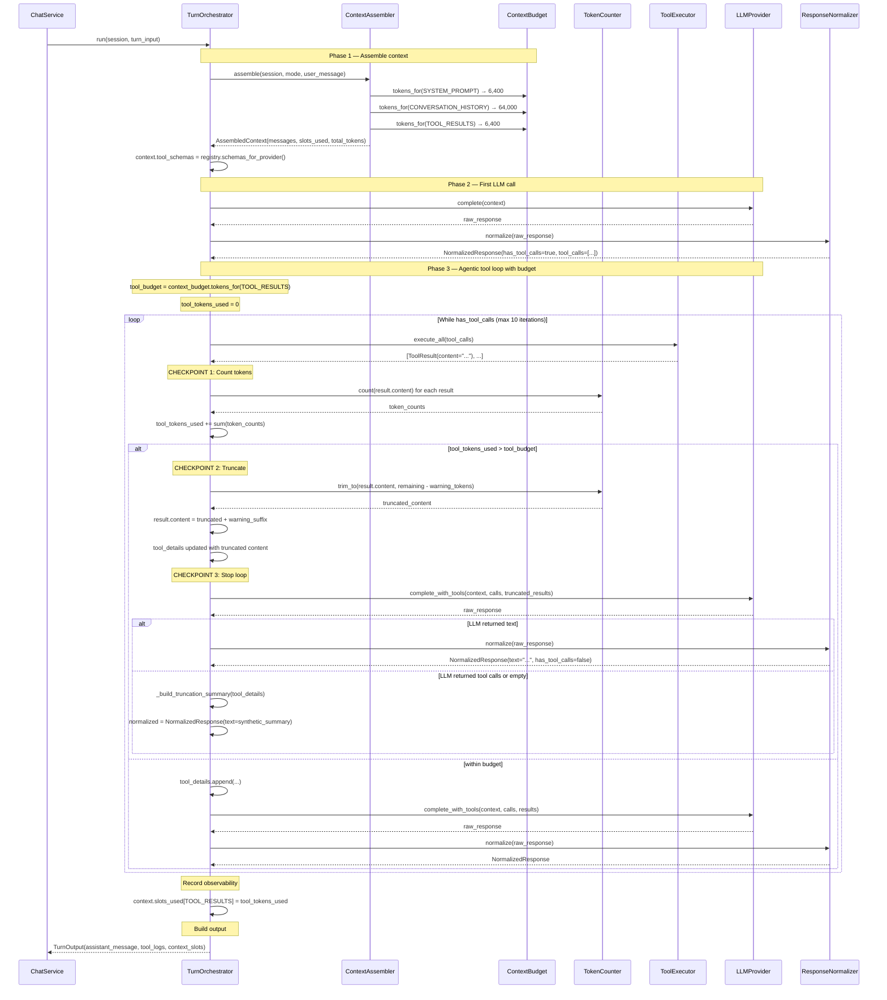
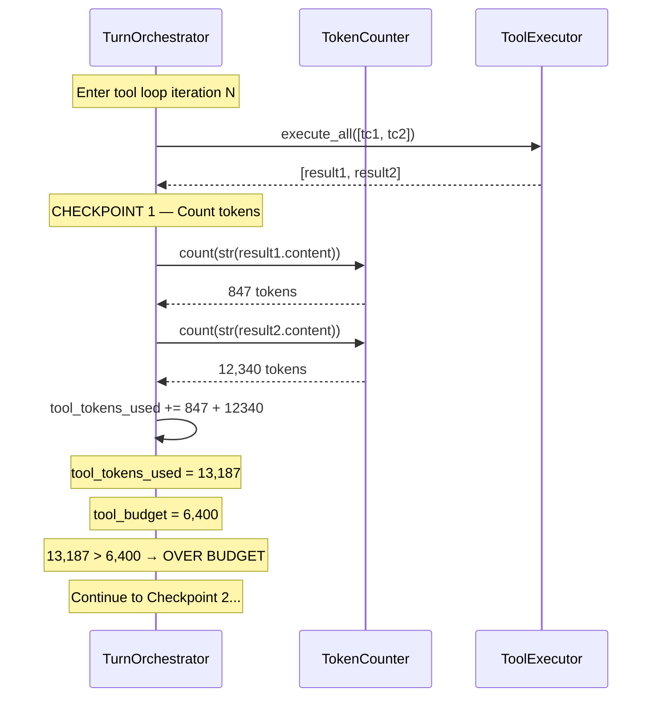
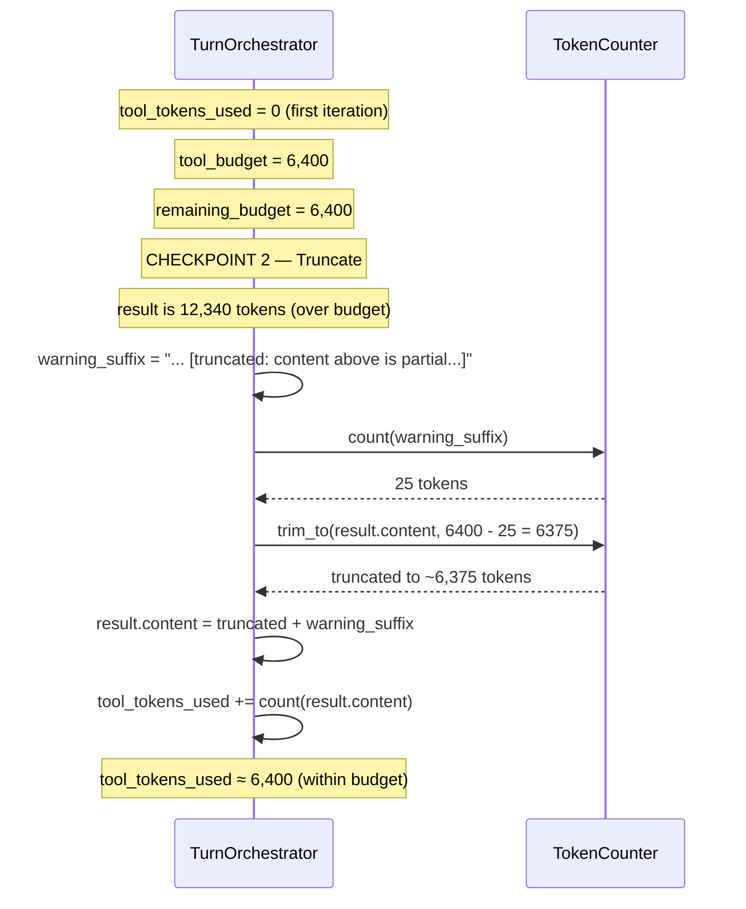
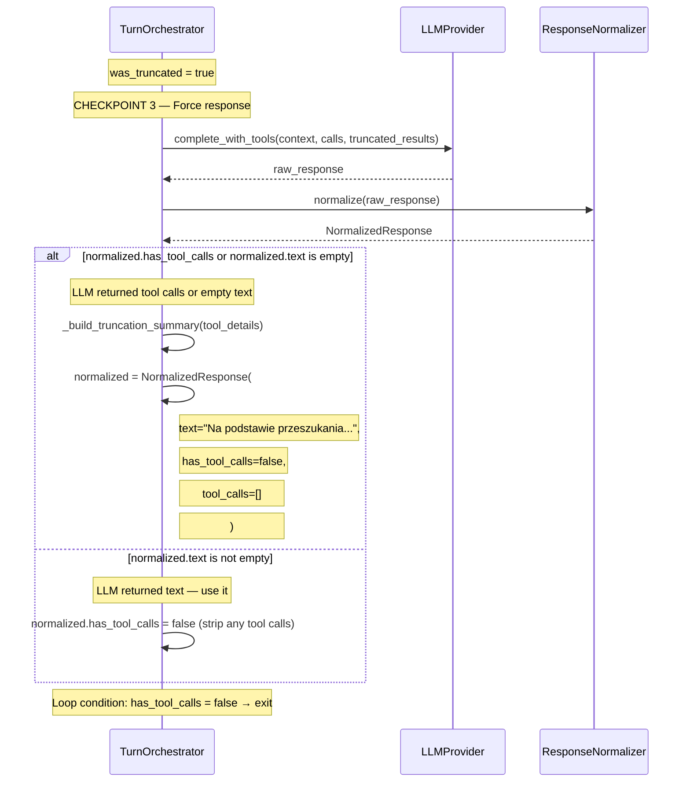

# F01 — Token Budget Enforcement in Tool Loop

Implementation specification. Documents how token budget enforcement works
in the agentic tool loop to prevent context window overflow from large tool
results.

**Status:** Implemented + Hardened
**Commits:** `9f79161`, `17d5a3e`, `1b2f5bc`
**Tests:** 14 tests in `tests/unit/agent/test_token_budget.py`

---

## Overview

The agentic tool loop counts tokens after each tool execution. When
accumulated tool results exceed the budget (from `ContextBudget.TOOL_RESULTS`),
the current result is truncated with a warning and the loop stops. The LLM
produces a best-effort response from the partial results it has.

### Key Design Principle

**The knowledge base is a filter/modifier on the LLM's general expertise.**
The LLM has deep knowledge from training. The knowledge base provides
company-specific standards, local pricing, and workflow templates. When
tool results are truncated, the LLM should answer from its general
knowledge + partial results, not retry the search.

---

## Problems Observed & Fixes Applied

### Problem 1: LLM Retries Search Instead of Answering

**Symptom:** When tool results were truncated by the token budget, the LLM
(Claude Sonnet, Mimo) would call `search_knowledge_base` again instead of
answering from partial results.

**Root Cause:** The truncation warning said:

```
"... [truncated: result was too large for context budget. Ask a more specific question or narrow your search.]"
```

This told the LLM to ask the user for clarification, causing infinite retry loops.

**Fix (commit `1b2f5bc`):** Changed warning to:

```
"... [truncated: content above is partial. Answer from what you have.
If you need more detail on a specific file, use read_file on the most
relevant file path shown above.]"
```

---

### Problem 2: Empty Response After Budget Exceeded

**Symptom:** After tool results were truncated, the LLM returned tool calls
instead of text. The orchestrator stripped the tool calls, leaving an empty
response (0 characters).

**Root Cause:** The orchestrator sent truncated results to the LLM and
overrode `has_tool_calls=False`, but if the LLM returned no text (only
tool calls), the response was empty.

**Fix (commit `1b2f5bc`):** Added `_build_truncation_summary()` method
that generates a synthetic response when the LLM returns no text:

```python
def _build_truncation_summary(self, tool_details: list[ToolCallDetail]) -> str:
    # Extracts file paths and key findings from tool results
    # Returns a structured summary with:
    # - List of files found
    # - Key findings (lines with >> markers)
    # - Advice to ask more specific questions or use read_file
```

**Result:** When LLM returns no text, user sees:

```
Na podstawie przeszukania bazy wiedzy znalazłem informacje w nastêpuj¹cych plikach:

- `data/04_Okucia_i_Akcesoria/Szuflady_Blum_Kompendium.md`
- `data/00_Dokumenty_Strategiczne/Standardy_Materialowe.md`

Kluczowe znaleziska:
1. Szuflady: Blum Merivobox lub Tandembox Antaro...
2. Legrabox to system dla projektów architektonicznych...

---
_Uwaga: Wyniki zostały ograniczone limitem tokenów._
```

---

### Problem 3: Parallel Tool Calls Exhaust Budget in One Iteration

**Symptom:** LLM makes parallel tool calls (e.g., two searches at once).
Both results together exceed the budget. First result is truncated, second
is skipped. LLM receives partial data and tries to search again.

**Root Cause:** The 6,400 token budget is tight when the LLM makes
parallel calls. A single `search_knowledge_base` with `context_lines=3`
can return 12,000+ tokens.

**Mitigation:**

1. Warning message tells LLM to answer from partial data
2. `_build_truncation_summary()` provides synthetic response if LLM fails
3. System prompt teaches LLM to search strategically (not exhaustively)

**Future Work:**

- Consider increasing `TOOL_RESULTS` allocation from 5% to 8-10%
- Implement smarter truncation that preserves file headers and key findings

---

## Sequence Diagram — Full Flow



---

## The Three Checkpoints

| #   | Where                         | What                                              | Effect                            |
| --- | ----------------------------- | ------------------------------------------------- | --------------------------------- |
| 1   | After `_execute_tool_calls()` | `TC.count(result.content)` per result             | Accumulates `tool_tokens_used`    |
| 2   | When budget exceeded          | `TC.trim_to(content, remaining - warning_tokens)` | Truncates result, appends warning |
| 3   | When budget exceeded          | Check if LLM returned text; if not, use synthetic | Ensures non-empty response        |

---

## Detailed Sequence — Checkpoint 1 (Token Counting)



---

## Detailed Sequence — Checkpoint 2 (Truncation)



---

## Detailed Sequence — Checkpoint 3 (Synthetic Response)



---

## Budget Source

Budget comes from `ContextBudget.tokens_for(ContextSlot.TOOL_RESULTS)`:

```python
# context_assembler.py
ContextSlot.TOOL_RESULTS: 0.05,  # 5% of total context
```

At 128K context = **6,400 tokens** for tool results.

| Slot                 | Allocation | Tokens (128K) | Rationale                     |
| -------------------- | ---------- | ------------- | ----------------------------- |
| SYSTEM_PROMPT        | 5%         | 6,400         | Fixed — prompt mode           |
| CONVERSATION_HISTORY | 50%        | 64,000        | Main context — most important |
| ATTACHED_NOTES       | 15%        | 19,200        | User-attached content         |
| ATTACHED_FILES       | 15%        | 19,200        | User-attached content         |
| SEARCH_RESULTS       | 10%        | 12,800        | Search tool results           |
| TOOL_RESULTS         | 5%         | 6,400         | Agent tool loop results       |

The 5% is a _budget cap_, not a target. Most tool iterations use far less.

---

## Implementation Details

### Where counting happens

Tokens are counted **in the orchestrator**, not in `ToolExecutor`. This
keeps `ToolExecutor` ignorant of token budgets — it only needs
`ToolRegistryProtocol`.

```python
# In TurnOrchestrator._count_and_truncate_tool_results():
for tr in tool_results:
    tokens = self._token_counter.count(tr.content)
    remaining_budget = tool_budget_tokens - tool_tokens_used

    if tokens > remaining_budget and remaining_budget > 0:
        truncate_budget = max(0, remaining_budget - warning_tokens)
        tr.content = self._token_counter.trim_to(tr.content, truncate_budget)
        tr.content += warning_suffix
        ...
```

### Truncation strategy

**Truncate + warn + fallback.** When a result exceeds remaining budget:

1. Reserve space for warning text (`warning_tokens`)
2. Truncate content to `remaining_budget - warning_tokens`
3. Append warning suffix: `"... [truncated: content above is partial. Answer from what you have...]"`
4. Stop the loop — LLM produces response from partial results
5. **If LLM returns no text** → `_build_truncation_summary()` generates synthetic response

### What gets truncated

The raw `ToolResult.content` string (a stringified dict). This is
tool-agnostic — no knowledge of the tool's output format is needed.

### What the LLM sees

The truncated tool result with a clear warning:

```
{'content': '=== data/hinges.md ===
>> 5: Blum hinges are high-quality...
>> 12: For Blum CLIP top, use 71B3...

... [truncated: content above is partial. Answer from what you have.
If you need more detail on a specific file, use read_file on the most
relevant file path shown above.]'}
```

### Observability

After the tool loop, `context.slots_used[ContextSlot.TOOL_RESULTS]` is
populated with the actual token count used. This appears in `TurnOutput`
for logging and debugging.

---

## What Changed

| Component                                             | Change                                                        | Lines |
| ----------------------------------------------------- | ------------------------------------------------------------- | ----- |
| `TurnOrchestrator.__init__`                           | Added `token_counter` and `context_budget` optional params    | +4    |
| `TurnOrchestrator._get_tool_budget_tokens()`          | New method — reads budget from `ContextBudget`                | +5    |
| `TurnOrchestrator._count_and_truncate_tool_results()` | New method — counts, truncates, warns                         | +35   |
| `TurnOrchestrator._build_truncation_summary()`        | **NEW** — synthetic response when LLM returns no text         | +45   |
| `TurnOrchestrator.run()`                              | Budget check + synthetic fallback after `_execute_tool_calls` | +30   |
| `TurnOrchestrator.stream()`                           | Same budget check + synthetic fallback in streaming path      | +35   |
| `dependencies.py`                                     | Inject `token_counter` and `context_budget`                   | +2    |
| `ToolResult`                                          | **No change**                                                 | 0     |
| `ToolExecutor`                                        | **No change**                                                 | 0     |
| `ContextAssembler`                                    | **No change**                                                 | 0     |

---

## Design Decisions

| #   | Decision            | Choice                       | Rationale                                            |
| --- | ------------------- | ---------------------------- | ---------------------------------------------------- |
| 1   | Truncation strategy | Truncate + warn + fallback   | LLM can adapt; fallback ensures non-empty response   |
| 2   | Where to count      | In Orchestrator              | Keeps `ToolExecutor` clean, orchestrator owns policy |
| 3   | Budget source       | `ContextBudget.TOOL_RESULTS` | Already defined at 5%, configurable                  |
| 4   | What to truncate    | Raw content string           | Tool-agnostic, no format knowledge needed            |
| 5   | Warning text        | In tool result content       | LLM sees it as part of the tool output               |
| 6   | Metric tracking     | `slots_used[TOOL_RESULTS]`   | Observability via existing `context_slots`           |
| 7   | Empty response      | Synthetic fallback           | User always gets useful response                     |

---

## Token Counting Accuracy

`ToolResult.content` is a `str(dict)`. Token counting on this string is
an approximation because providers re-serialize differently:

| Provider  | How content is used                             | Accuracy |
| --------- | ----------------------------------------------- | -------- |
| Gemini    | `FunctionResponse(response=dict)` — parsed back | ±10%     |
| Anthropic | `tool_result.content=str` — stays as string     | Exact    |
| Mimo      | `tool.content=str` — stays as string            | Exact    |

±10% is acceptable — we're preventing runaway, not optimizing.

---

## Edge Cases

| Case                                    | Behavior                                         |
| --------------------------------------- | ------------------------------------------------ |
| No `token_counter` injected             | Budget enforcement skipped (backward compatible) |
| No `context_budget` injected            | Budget enforcement skipped (backward compatible) |
| Single result 3x over budget            | Truncated to fit, loop stops                     |
| Two results, together over budget       | First passes, second truncated, loop stops       |
| All results within budget               | No truncation, loop continues normally           |
| Budget set to 0                         | First result truncated immediately               |
| `use_tools=False`                       | Budget code never reached (tools not executed)   |
| LLM returns tool calls after truncation | Synthetic response generated                     |
| LLM returns empty text after truncation | Synthetic response generated                     |

---

## Tests

14 tests in `tests/unit/agent/test_token_budget.py`:

| Class                             | Test                                        | Verifies                             |
| --------------------------------- | ------------------------------------------- | ------------------------------------ |
| `TestTokenCountingAfterExecution` | `test_tool_tokens_counted_in_output`        | `TOOL_RESULTS` slot populated        |
|                                   | `test_multiple_tool_calls_tokens_summed`    | Multiple results summed              |
| `TestTruncationWhenOverBudget`    | `test_large_result_truncated`               | Content truncated with marker        |
|                                   | `test_truncation_preserves_budget_boundary` | Fits within budget after truncation  |
| `TestWarningMessageOnTruncation`  | `test_warning_appended_to_tool_result`      | Warning in tool result content       |
| `TestLoopTerminationOnBudget`     | `test_loop_stops_when_budget_exceeded`      | Second call blocked                  |
|                                   | `test_loop_continues_when_within_budget`    | Both calls proceed                   |
| `TestNormalOperationUnaffected`   | `test_text_only_response_unchanged`         | No tools = no change                 |
|                                   | `test_small_tool_result_unchanged`          | Small results untruncated            |
| `TestTokenAccumulation`           | `test_accumulated_tokens_across_iterations` | Tokens accumulate                    |
| `TestBudgetSource`                | `test_budget_respects_allocation`           | Custom 10% allocation works          |
|                                   | `test_small_budget_triggers_truncation`     | 1% budget truncates moderate content |

---

## Debug Logging

### Log Event Map

The full request lifecycle is logged with consistent event names:

| Layer            | Event Name                                 | Level | When                            |
| ---------------- | ------------------------------------------ | ----- | ------------------------------- |
| ChatService      | `stream_turn_started`                      | INFO  | Turn begins                     |
| TurnOrchestrator | `orchestrator_stream_start`                | INFO  | Provider resolved               |
| Provider         | `{provider}_stream_start`                  | INFO  | API call begins                 |
| Provider         | `{provider}_stream_end`                    | DEBUG | Stream complete, chunks count   |
| Normalizer       | `normalize_result`                         | DEBUG | Response normalized             |
| TurnOrchestrator | `orchestrator_stream_tool_iteration`       | INFO  | Tool loop iteration N           |
| ToolExecutor     | `tool_executor_batch_start`                | DEBUG | Batch begins                    |
| ToolExecutor     | `tool_executing`                           | DEBUG | Per-tool: name, args_keys       |
| ToolExecutor     | `tool_executed`                            | DEBUG | Per-tool: result_size, duration |
| ToolExecutor     | `tool_executor_batch_complete`             | DEBUG | Batch done, error count         |
| Provider         | `{provider}_tool_result_sent`              | DEBUG | Tool result sent to LLM         |
| Provider         | `{provider}_stream_with_tools_start`       | DEBUG | LLM call with tool results      |
| TurnOrchestrator | `tool_result_truncated`                    | WARN  | Budget exceeded                 |
| TurnOrchestrator | `orchestrator_stream_tool_budget_exceeded` | WARN  | Loop stopping                   |
| TurnOrchestrator | `orchestrator_forcing_text_response`       | WARN  | Synthetic response used         |
| ChatService      | `stream_turn_completed`                    | INFO  | Turn done                       |

### Example Log Output

```
stream_turn_started           mode=general, use_tools=True
orchestrator_stream_start     provider=mimo, model=mimo-v2.5-pro
mimo_stream_start             messages=2, tools=5, temperature=0.2
mimo_stream_end               chunks=11, tool_calls=1
normalize_result              has_tool_calls=True, text_length=0
orchestrator_stream_tool_iteration  iteration=1, tool_calls=['search_knowledge_base']
tool_executor_batch_start     tool_count=1
tool_executing                tool_name=search_knowledge_base, args_keys=['query', 'context_lines']
tool_executed                 result_size=66405, duration=40.34ms, is_error=False
tool_executor_batch_complete  errors=0
tool_result_truncated         tool_name=search_knowledge_base, original=14640, truncated=6400
orchestrator_stream_tool_budget_exceeded  tool_budget=6400, tool_used=6400
mimo_tool_result_sent         tool_name=search_knowledge_base, result_size=25597
mimo_stream_with_tools_start  tool_calls=1, tool_results=1
mimo_stream_with_tools_end    chunks=431, text_length=3379
stream_turn_completed         response_length=3379, tool_calls=1
```

---

## Real-World Observations

### Provider Behavior Comparison

| Behavior                    | Mimo (mimo-v2.5-pro) | Claude Sonnet        |
| --------------------------- | -------------------- | -------------------- | --------------------- |
| Regex understanding         | ✅ Uses `            | ` correctly          | ⚠️ Needs 2-3 attempts |
| Parallel tool calls         | ✅ Sequential        | ⚠️ Parallel (risky)  |
| Follows truncation warning  | ⚠️ Sometimes retries | ⚠️ Sometimes retries |
| Generates synthetic text    | ✅ After fallback    | ✅ After fallback    |
| Average tool calls per turn | 2-3                  | 1-2                  |

### Token Budget Impact

| Scenario                       | Tool Calls | Tokens Used | Truncated? |
| ------------------------------ | ---------- | ----------- | ---------- |
| Simple question, one search    | 1          | ~2,000      | No         |
| Complex question, 2 searches   | 2          | ~5,000      | Sometimes  |
| Parallel searches (Claude)     | 2 parallel | ~12,000     | Yes        |
| Deep dive (search + read_file) | 2-3        | ~8,000      | Yes        |

### Recommendation

For complex questions, the LLM should:

1. Call `get_repo_map` first (lightweight, ~500 tokens)
2. Call `search_knowledge_base` with specific terms (~2,000-4,000 tokens)
3. If needed, call `read_file` on the most relevant file (~3,000-5,000 tokens)

This stays within the 6,400 token budget for most cases.
