# Kitchen Agent — Frontend Architecture Diagrams

Mermaid diagrams documenting the Svelte 5 frontend architecture.
Generated from `svelte-map` analysis, updated 2026-06-17 (post-refactor).

---

## 1. Component Hierarchy

```mermaid
graph TB
    subgraph Routes["SvelteKit Routes"]
        Layout["+layout.svelte<br/>favicon, global head"]
        RootPage["+page.svelte<br/>redirect → /chat/{uuid}"]
        ChatPage["chat/[id]/+page.svelte<br/>main orchestrator"]
        ErrorPage["chat/[id]/+error.svelte<br/>error boundary"]
    end

    subgraph ChatArea["Chat Area (left panel)"]
        ChatHeader["ChatHeader<br/>title, mode badge"]
        ChatMessageList["ChatMessageList<br/>scrollable messages"]
        ChatComposer["ChatComposer<br/>input orchestrator"]
    end

    subgraph Sidebar["Sidebar (left panel)"]
        SidebarLayout["SidebarLayout<br/>composes panels"]
        ContextSidebar["ContextSidebar<br/>files + notes"]
    end

    subgraph SidebarPanels["Sidebar Panels"]
        FolderTree["FolderTree<br/>folder list + drop zones"]
        SessionPanel["SessionPanel<br/>session forest"]
        ArchivedPanel["ArchivedPanel<br/>archived sessions"]
    end

    subgraph ComposerSubs["Composer Sub-Components"]
        ComposerActions["ComposerActions<br/>buttons, tools, send/stop"]
        ModelSelector["ModelSelector<br/>optgroup select"]
        TokenIndicator["TokenIndicator<br/>token bar"]
    end

    subgraph MessageSubs["Message Sub-Components"]
        MessageActions["MessageActions<br/>edit/delete/fork"]
        MessageEditor["MessageEditor<br/>inline edit"]
        SystemPromptBubble["SystemPromptBubble<br/>prompt display"]
        Markdown["Markdown<br/>parsed markdown"]
    end

    subgraph SessionSubs["Session Sub-Components"]
        DraggableSession["DraggableSession<br/>drag wrapper"]
        FolderItem["FolderItem<br/>single folder + sessions"]
        SessionTreeNode["SessionTreeNode<br/>recursive tree node"]
        SessionContextMenu["SessionContextMenu<br/>right-click menu"]
        CreateFolderDialog["CreateFolderDialog<br/>new folder modal"]
    end

    subgraph SidebarSubs["Sidebar Sub-Components"]
        NotesPanel["NotesPanel<br/>notes list"]
        NotePopup["NotePopup<br/>create note"]
        FileEditor["FileEditor<br/>edit context file"]
    end

    subgraph Shared["Shared / UI Components"]
        Dialog["Dialog<br/>base modal"]
        ConfirmDialog["ConfirmDialog<br/>modal confirm"]
        ArchiveConfirmDialog["ArchiveConfirmDialog<br/>archive with children/folder options"]
        MoveToFolderDialog["MoveToFolderDialog<br/>multi-folder select with children option"]
    end

    %% Route hierarchy
    Layout --> RootPage
    Layout --> ChatPage
    Layout --> ErrorPage

    %% Page composition
    ChatPage --> ChatHeader
    ChatPage --> ChatMessageList
    ChatPage --> ChatComposer
    ChatPage --> SidebarLayout
    ChatPage --> ContextSidebar
    ChatPage --> NotePopup

    %% Sidebar composition
    SidebarLayout --> FolderTree
    SidebarLayout --> SessionPanel
    SidebarLayout --> ArchivedPanel

    %% Chat area composition
    ChatMessageList --> MessageActions
    ChatMessageList --> MessageEditor
    ChatMessageList --> SystemPromptBubble
    ChatMessageList --> Markdown
    ChatMessageList --> ConfirmDialog

    ChatComposer --> ComposerActions
    ChatComposer --> TokenIndicator
    ComposerActions --> ModelSelector

    %% Shared UI
    ConfirmDialog --> Dialog
    CreateFolderDialog --> Dialog
    ArchiveConfirmDialog --> Dialog
    MoveToFolderDialog --> Dialog

    %% Session tree composition
    SessionPanel --> DraggableSession
    SessionPanel --> SessionTreeNode
    ArchivedPanel --> DraggableSession
    ArchivedPanel --> SessionTreeNode
    FolderTree --> FolderItem
    FolderTree --> CreateFolderDialog
    SessionTreeNode --> SessionContextMenu

    %% Context sidebar composition
    ContextSidebar --> NotesPanel
    ContextSidebar --> FileEditor

    %% NotePopup is a portal (renders at page level)
    NotePopup -.->|"portal"| ChatPage

    style Routes fill:#e8f4f8,stroke:#2196F3
    style ChatArea fill:#e3f2fd,stroke:#1565C0
    style Sidebar fill:#fff3e0,stroke:#FF9800
    style SidebarPanys fill:#fff3e0,stroke:#FF9800
    style ComposerSubs fill:#f3e5f5,stroke:#9C27B0
    style MessageSubs fill:#fce4ec,stroke:#E91E63
    style SessionSubs fill:#e8f5e9,stroke:#4CAF50
    style SidebarSubs fill:#fff8e1,stroke:#FFC107
    style Shared fill:#efebe9,stroke:#795548
```

---

## 2. Store Architecture

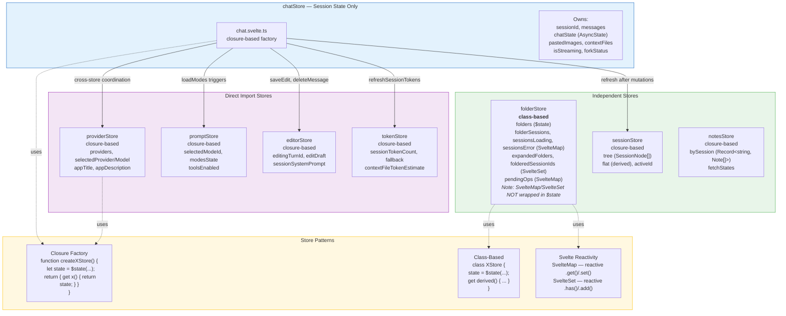

---

## 3. Store → Component Consumer Map (Post-Refactor)

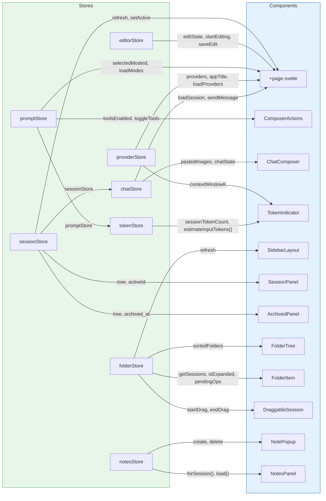

---

## 4. Chat Data Flow (Send → Stream → Display)

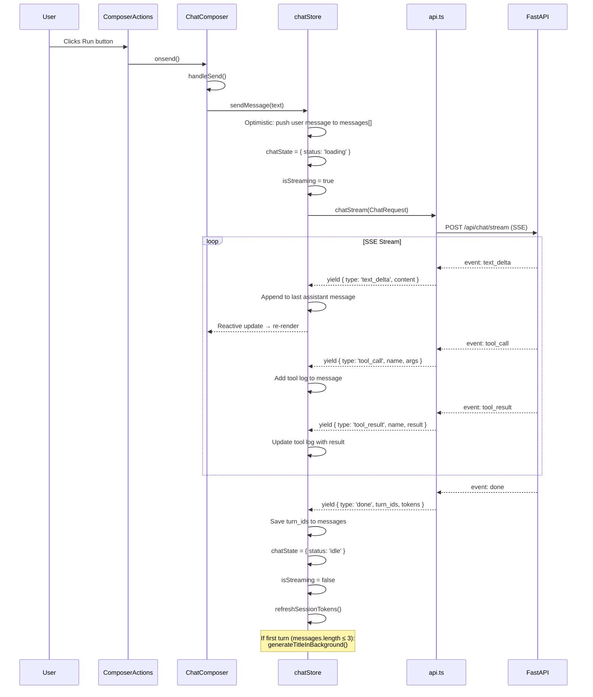

---

## 5. Sidebar Architecture (Post-Refactor)

```mermaid
graph TB
    subgraph SidebarLayout["SidebarLayout — Top-Level Container"]
        FolderSection["Folder Section"]
        SessionSection["Session Section"]
        ArchivedSection["Archived Section"]
    end

    subgraph FolderSystem["Folder System"]
        FolderTree["FolderTree<br/>Creates drop zones per folder"]
        FolderItem["FolderItem<br/>Expandable folder with sessions"]
        CreateFolder["CreateFolderDialog → Dialog"]
        DropZone["use:droppable<br/>accepts: session"]
    end

    subgraph SessionSystem["Session Panel"]
        SessionPanel["SessionPanel<br/>Header + error toast + forest"]
        DraggableSession["DraggableSession<br/>use:draggable"]
        SessionTreeNode["SessionTreeNode<br/>Recursive: renders children"]
        ContextMenu["SessionContextMenu<br/>Right-click actions"]
    end

    subgraph ArchivedSystem["Archived Panel"]
        ArchivedPanel["ArchivedPanel<br/>Expand/collapse toggle"]
        ArchivedSessions["Archived session rendering"]
    end

    subgraph DragDrop["Drag & Drop Flow"]
        DragStart["Drag Start<br/>folderStore.startDrag(payload)"]
        DragOver["Drag Over<br/>folderStore.setDropTarget(target)"]
        Drop["Drop<br/>folderStore.assignSession(folderId, sessionId)"]
        DragEnd["Drag End<br/>folderStore.endDrag()"]
        PendingOps["pendingOps tracking<br/>SvelteMap for UX"]
    end

    subgraph folderStore["folderStore (class-based)"]
        Folders["$state: folders[]"]
        Expanded["SvelteSet: expandedFolders,<br/>folderedSessionIds<br/>(no $state — built-in reactivity)"]
        Sessions["SvelteMap: folderSessions,<br/>sessionsLoading, sessionsError<br/>(no $state — built-in reactivity)"]
        Drag["$state: dragPayload, dropTarget"]
        Pending["SvelteMap: pendingOps<br/>(no $state — built-in reactivity)"]
        Methods["assignSession(), invalidateSessions()<br/>toggleExpand(), isExpanded()<br/>getSessions() → queueMicrotask(fetchSessions)"]
    end

    FolderSection --> FolderTree
    FolderTree --> DropZone
    DropZone --> FolderItem
    FolderItem -->|"expanded"| Sessions
    FolderTree --> CreateFolder

    SessionSection --> SessionPanel
    SessionPanel --> DraggableSession
    DraggableSession --> SessionTreeNode
    SessionTreeNode --> ContextMenu
    SessionTreeNode -->|"children"| SessionTreeNode

    ArchivedSection --> ArchivedPanel
    ArchivedPanel --> ArchivedSessions

    DraggableSession -->|"ondragstart"| DragStart
    DropZone -->|"ondragenter"| DragOver
    DropZone -->|"ondrop"| Drop
    DraggableSession -->|"ondragend"| DragEnd

    DragStart --> Drag
    DragOver --> Drag
    Drop --> Methods
    Drop --> Sessions
    Drop --> PendingOps
    DragEnd --> Drag

    SidebarLayout --> folderStore
    FolderTree --> folderStore
    FolderItem --> folderStore
    DraggableSession --> folderStore

    style SidebarLayout fill:#e3f2fd,stroke:#1565C0
    style FolderSystem fill:#e8f5e9,stroke:#4CAF50
    style SessionSystem fill:#fff3e0,stroke:#FF9800
    style ArchivedSystem fill:#fce4ec,stroke:#E91E63
    style DragDrop fill:#f3e5f5,stroke:#9C27B0
    style folderStore fill:#fff8e1,stroke:#FFC107
```

---

## 6. Svelte 5 Features Usage Map

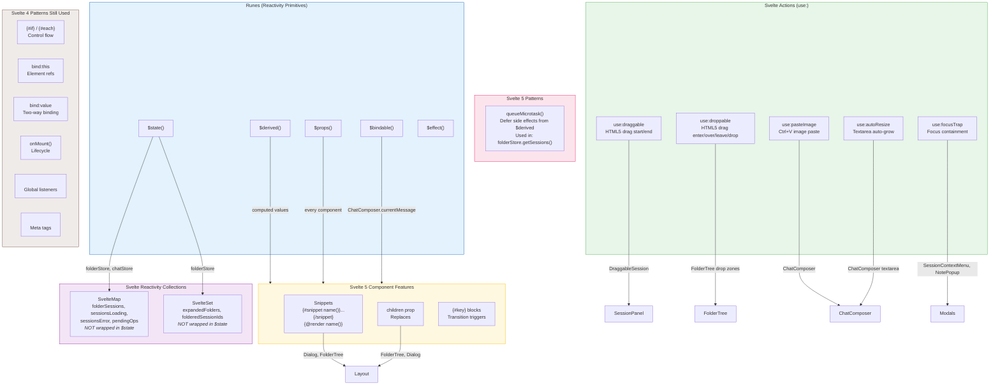

---

## 7. Route Structure & Navigation

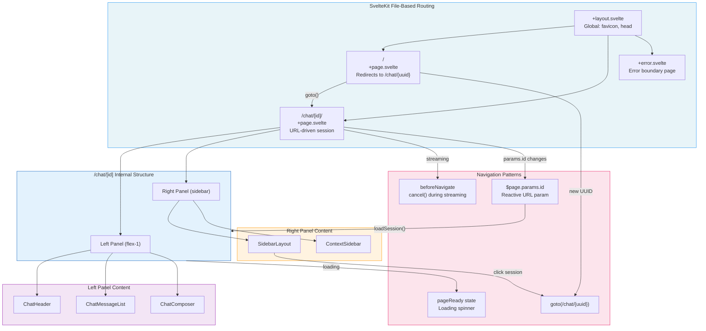

---

## 8. Component Responsibility Matrix (Post-Refactor)

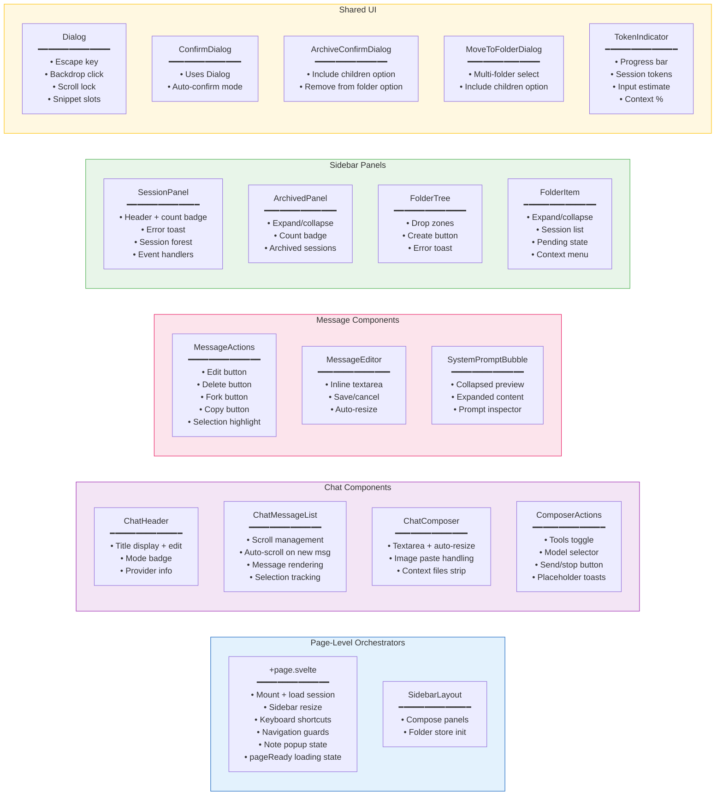

---

## 9. Hotspot Analysis (Post-Refactor)

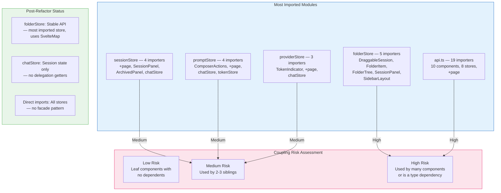

---

## 10. Shared Types Architecture

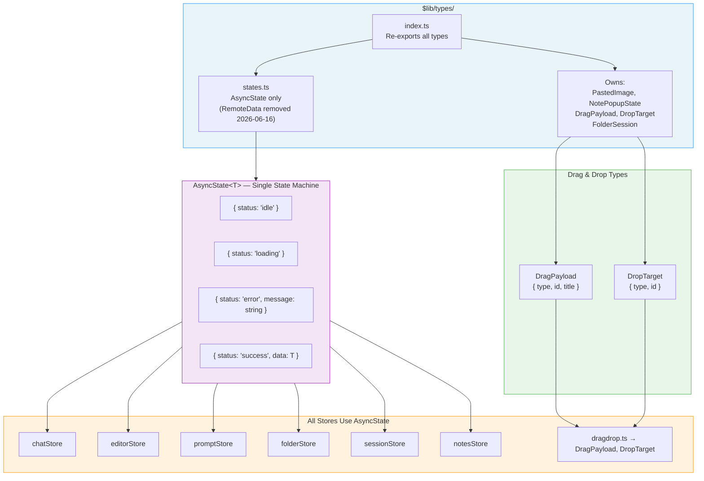

---

## 11. Session State Machine

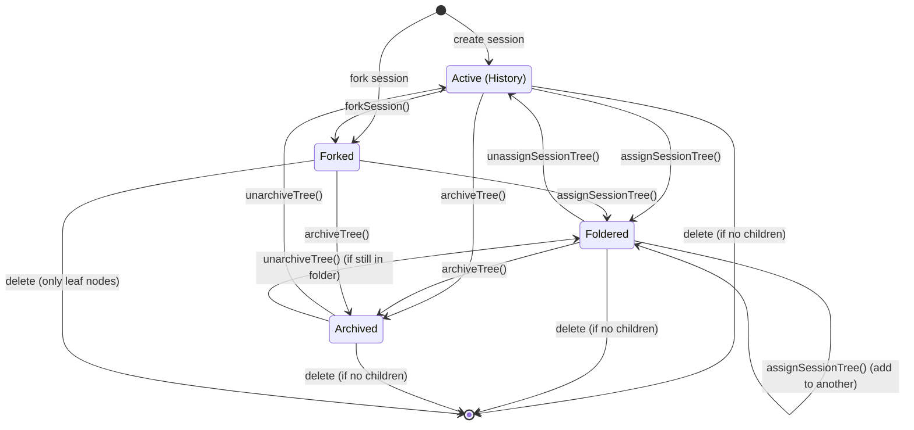

### Session State Flags

```typescript
interface SessionFlags {
    is_archived: boolean; // archived_at IS NOT NULL
    is_foldered: boolean; // in session_folders table
    is_fork: boolean; // parent_id IS NOT NULL
    is_fork_parent: boolean; // has children
    children_count: number; // number of direct children
    folder_ids: string[]; // folders containing this session
}
```

### Tree Operations

| Operation                 | Frontend                                                         | Backend                                        |
| ------------------------- | ---------------------------------------------------------------- | ---------------------------------------------- |
| Archive tree              | `sessionStore.archiveTree(id, includeChildren)`                  | `POST /api/sessions/{id}/archive/tree`         |
| Unarchive tree            | `sessionStore.unarchiveTree(id, includeChildren)`                | `DELETE /api/sessions/{id}/archive/tree`       |
| Assign tree to folder     | `folderStore.assignSessionTree(folderId, id, includeChildren)`   | `POST /api/folders/{id}/sessions/{sid}/tree`   |
| Unassign tree from folder | `folderStore.unassignSessionTree(folderId, id, includeChildren)` | `DELETE /api/folders/{id}/sessions/{sid}/tree` |
| Get session flags         | `sessionStore.getSessionFlags(id)`                               | `GET /api/sessions/{id}/flags`                 |

---

## Diagram Maintenance

| Change                | Diagrams to Update                                   |
| --------------------- | ---------------------------------------------------- |
| New component         | 1 (Hierarchy), 8 (Responsibility)                    |
| New store             | 2 (Architecture), 3 (Consumer Map)                   |
| New route             | 7 (Routes)                                           |
| New action (use:)     | 6 (Svelte 5 Features)                                |
| New type              | 10 (Shared Types)                                    |
| Store refactor        | 2 (Architecture), 3 (Consumer Map), 9 (Hotspots)     |
| Component refactor    | 1 (Hierarchy), 8 (Responsibility)                    |
| Drag-drop changes     | 5 (Sidebar Architecture)                             |
| Chat flow changes     | 4 (Chat Data Flow)                                   |
| Session state changes | 11 (Session State Machine), session-state-machine.md |

### Last Updated

| Date       | Change                                                                                 | Diagrams      |
| ---------- | -------------------------------------------------------------------------------------- | ------------- |
| 2026-06-21 | Diagram↔code alignment: fix importer counts, add missing components, remove stale refs | 1, 2, 3, 6, 9 |
| 2026-06-21 | Delete dead code: SessionTree.svelte, ProviderPicker.svelte                            | 1, 9          |
| 2026-06-21 | Remove line counts and bar charts (stale noise)                                        | All           |
| 2026-06-17 | Session state machine: tree operations (archiveTree, assignTree, getSessionFlags)      | 2, 3, 5, 9    |
| 2026-06-17 | New components: ArchiveConfirmDialog, MoveToFolderDialog                               | 1, 8          |
| 2026-06-17 | DOM access timing fixes: waitForTimeout removal, proper waiting patterns               | - (E2E tests) |
| 2026-06-17 | Fix: SvelteMap/SvelteSet reactivity (remove $state wrapping, defer getSessions fetch)  | 2, 5, 6       |
| 2026-06-17 | Refactor v2 complete (all 8 phases)                                                    | All (updated) |
