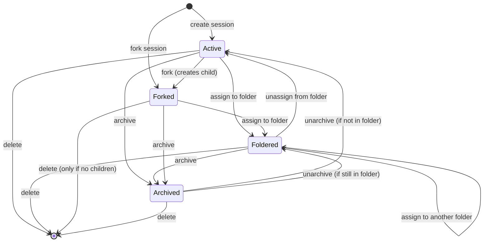
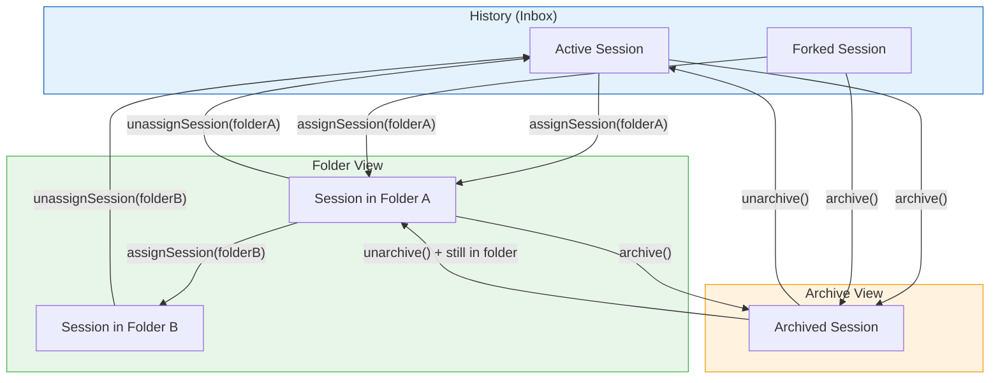
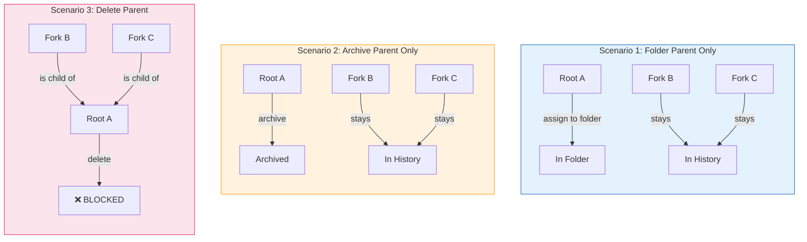
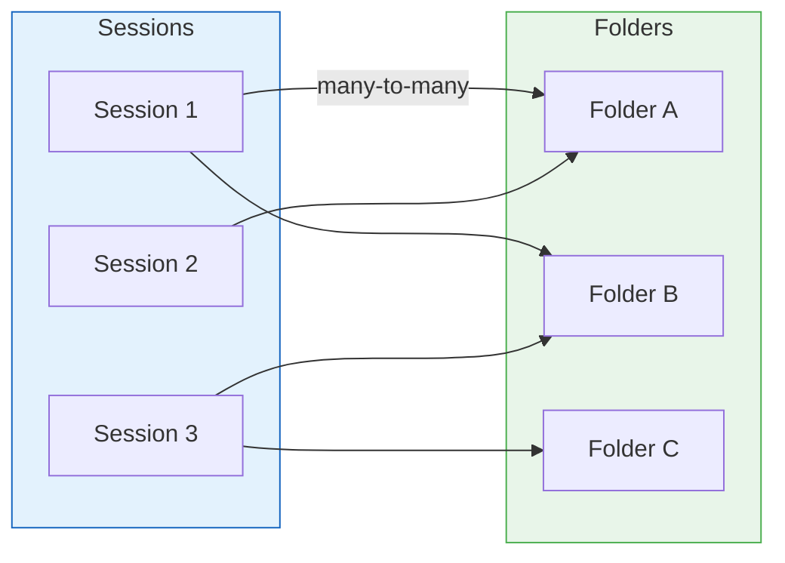
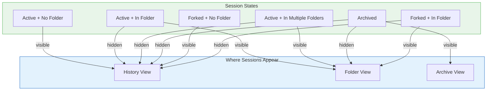
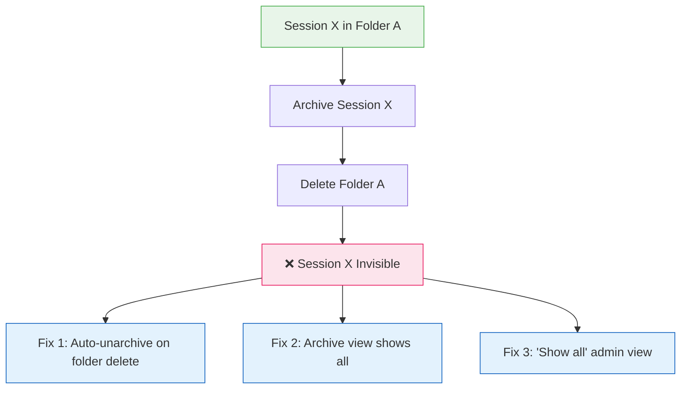
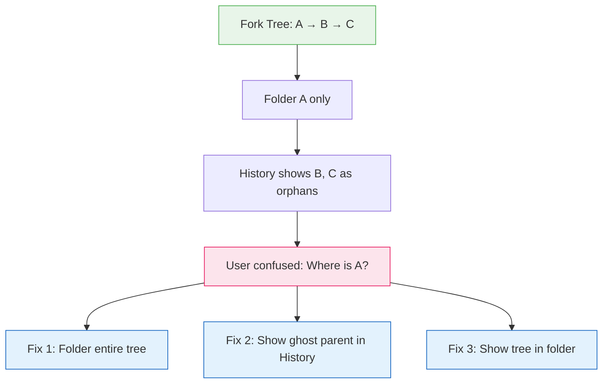
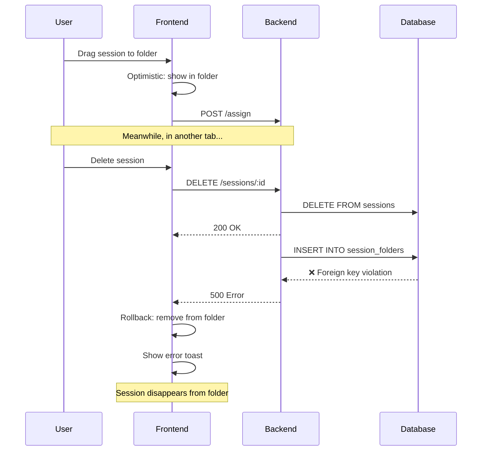
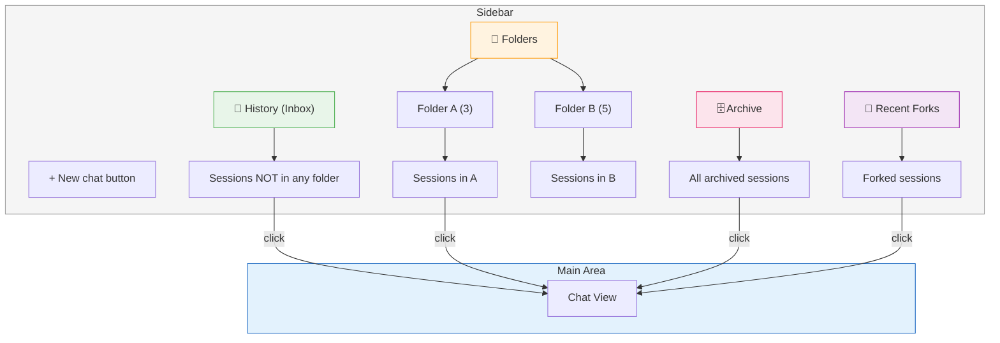
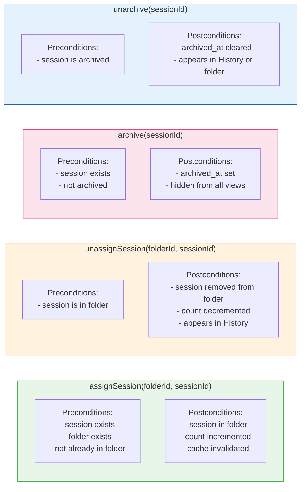

# Session State Diagrams

Mermaid diagrams for session movement between History, Folders, and Archive.

---

## 1. Session Lifecycle State Machine

---

## 2. Session Movement Flow

---

## 3. Fork Tree Scenarios

---

## 4. Folder Assignment Matrix

---

## 5. Visibility Matrix

---

## 6. Edge Case: Invisible Sessions

---

## 7. Edge Case: Fork Tree Fragmentation

---

## 8. Race Condition: Assign During Delete

---

## 9. Recommended UI Layout

---

## 10. Operation Preconditions & Postconditions

