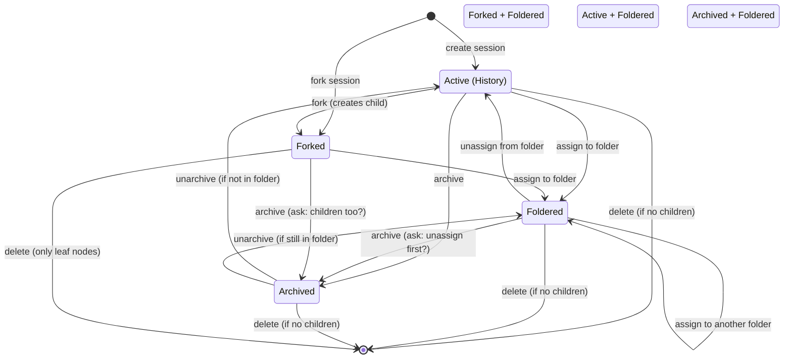
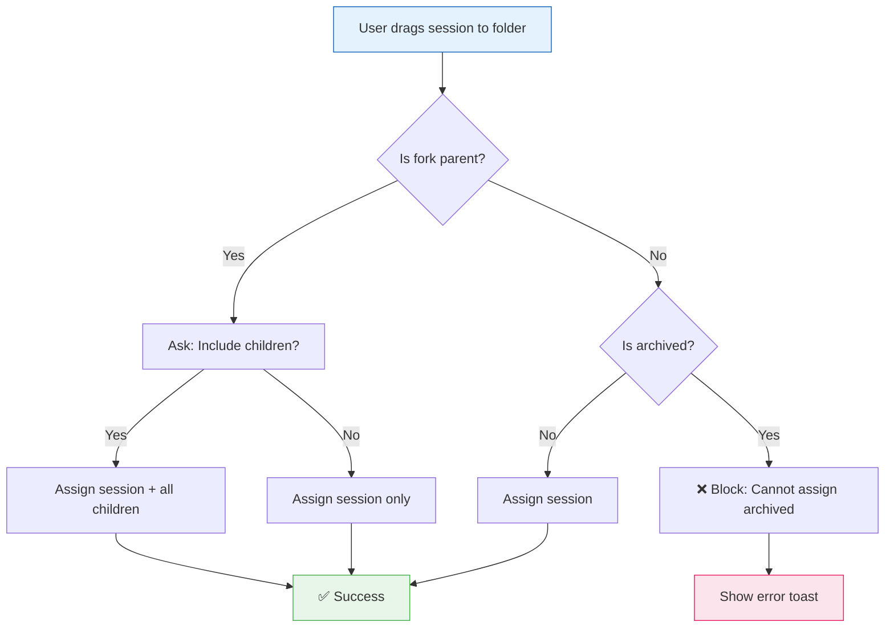
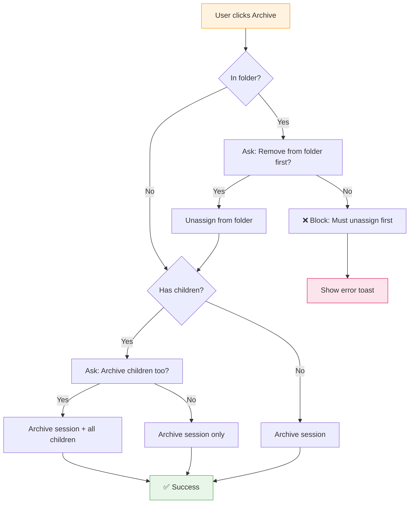
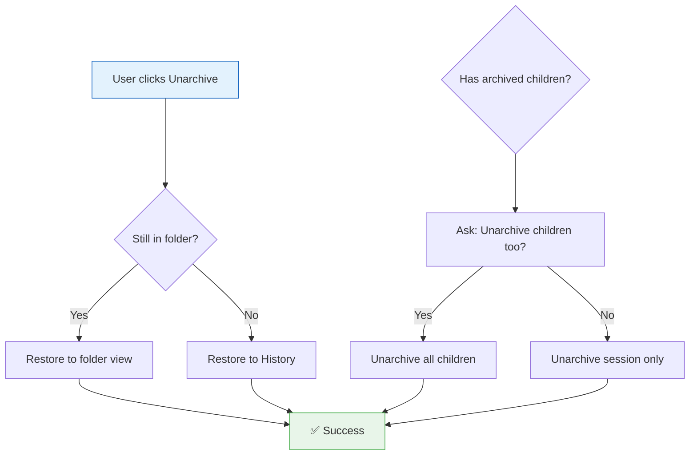
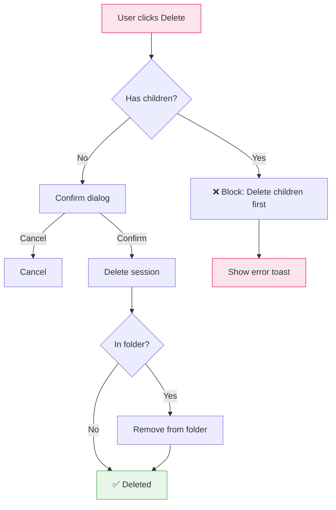
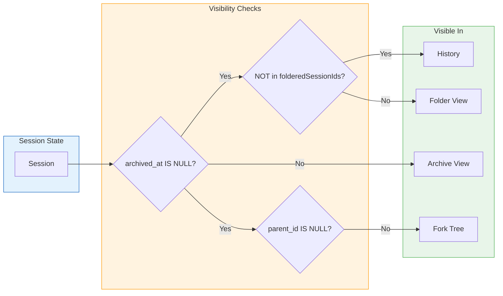
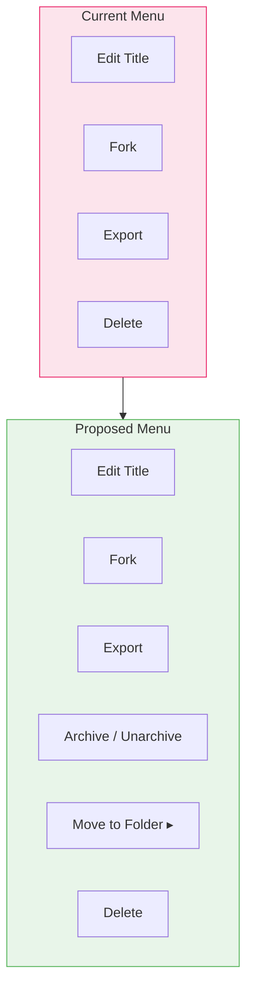

# Session State Machine — Final Design

**Decisions Made**: 2026-06-17  
**Status**: Ready for Implementation

---

## User Decisions

| Question                           | Decision                                           |
| ---------------------------------- | -------------------------------------------------- |
| Archive session in folder?         | Show option to remove from folder before archiving |
| Archive parent → archive children? | Ask user with checkbox                             |
| Folder parent → folder children?   | Keep them together (folder entire tree)            |
| Fork archived session?             | Not needed (disabled)                              |

---

## 1. State Definitions

```typescript
type SessionFlag =
    | 'active' // Not archived, not in folder
    | 'foldered' // In one or more folders
    | 'archived' // archived_at IS NOT NULL
    | 'forked' // parent_id IS NOT NULL
    | 'fork_parent'; // Has children (parent_id = this.id)

interface SessionState {
    isArchived: boolean;
    isFoldered: boolean;
    isFork: boolean;
    isForkParent: boolean;
    hasActiveChildren: boolean;
    folderIds: string[];
}
```

---

## 2. Complete State Diagram



---

## 3. Operation Flows

### 3.1 Assign to Folder (with Children)



### 3.2 Archive Session



### 3.3 Unarchive Session



### 3.4 Delete Session



---

## 4. Visibility Rules



---

## 5. UI Component Changes

### 5.1 SessionTreeNode Actions



### 5.2 Folder Assignment Dialog

```mermaid
flowchart TB
    subgraph Dialog["Move to Folder Dialog"]
        Title[Select Folder]
        Folders[Checkbox list of folders]
        Children[☐ Include children (if fork parent)]
        Buttons[Cancel | Move]
    end

    subgraph Actions["After Move"]
        Success[Session appears in folder]
        History[Removed from History]
        ChildrenMove[Children moved too if checked]
    end

    Dialog --> Actions

    style Dialog fill:#e3f2fd,stroke:#1565C0
    style Actions fill:#e8f5e9,stroke:#4CAF50
```

---

## 6. Database Schema (No Changes)

```sql
-- Existing schema supports all operations
CREATE TABLE sessions (
    id               TEXT PRIMARY KEY,
    title            TEXT,
    parent_id        TEXT,           -- Fork relationships
    fork_turn_index  INTEGER,
    root_id          TEXT,
    archived_at      TIMESTAMP,      -- NULL = active
    ...
);

CREATE TABLE folders (
    id           TEXT PRIMARY KEY,
    name         TEXT NOT NULL,
    parent_id    TEXT,               -- Nested folders
    ...
);

CREATE TABLE session_folders (
    session_id   TEXT NOT NULL,
    folder_id    TEXT NOT NULL,
    assigned_at  TIMESTAMP,
    PRIMARY KEY (session_id, folder_id),
    FOREIGN KEY (session_id) REFERENCES sessions(id) ON DELETE CASCADE,
    FOREIGN KEY (folder_id) REFERENCES folders(id) ON DELETE CASCADE
);
```

---

## 7. API Changes Required

### 7.1 New Endpoints

```typescript
// Assign session tree to folder (with children)
POST /api/folders/:folderId/sessions/:sessionId/tree
Body: { include_children: boolean }
Response: { assigned: string[], count: number }

// Archive session tree (with children)
POST /api/sessions/:sessionId/archive/tree
Body: { include_children: boolean }
Response: { archived: string[], count: number }

// Unarchive session tree (with children)
DELETE /api/sessions/:sessionId/archive/tree
Body: { include_children: boolean }
Response: { unarchived: string[], count: number }
```

### 7.2 Modified Endpoints

```typescript
// Existing: Check if session has children before allowing operations
GET /api/sessions/:sessionId/tree-info
Response: {
  session_id: string,
  has_children: boolean,
  children_count: number,
  is_archived: boolean,
  folder_ids: string[]
}
```

---

## 8. Frontend Store Changes

### 8.1 sessionStore Additions

```typescript
// New methods
async archiveTree(id: string, includeChildren: boolean): Promise<void>
async unarchiveTree(id: string, includeChildren: boolean): Promise<void>
async getSessionTreeInfo(id: string): Promise<TreeInfo>
```

### 8.2 folderStore Additions

```typescript
// New methods
async assignSessionTree(folderId: string, sessionId: string, includeChildren: boolean): Promise<void>
async unassignSessionTree(folderId: string, sessionId: string, includeChildren: boolean): Promise<void>
```

---

## 9. UI Dialog Components

### 9.1 ArchiveConfirmDialog

```svelte
<Dialog open={showArchiveDialog} onclose={cancelArchive}>
  <h2>Archive Session</h2>

  {#if hasChildren}
    <label>
      <input type="checkbox" bind:checked={includeChildren} />
      Also archive {childrenCount} child session(s)
    </label>
  {/if}

  {#if isFoldered}
    <label>
      <input type="checkbox" bind:checked={removeFromFolder} />
      Remove from folder "{folderName}"
    </label>
  {/if}

  <div slot="footer">
    <button onclick={cancelArchive}>Cancel</button>
    <button onclick={confirmArchive}>Archive</button>
  </div>
</Dialog>
```

### 9.2 MoveToFolderDialog

```svelte
<Dialog open={showMoveDialog} onclose={cancelMove}>
  <h2>Move to Folder</h2>

  <div class="folder-list">
    {#each folders as folder}
      <label>
        <input
          type="checkbox"
          checked={selectedFolders.has(folder.id)}
          onchange={() => toggleFolder(folder.id)}
        />
        {folder.icon} {folder.name}
      </label>
    {/each}
  </div>

  {#if hasChildren}
    <label>
      <input type="checkbox" bind:checked={includeChildren} />
      Also move {childrenCount} child session(s)
    </label>
  {/if}

  <div slot="footer">
    <button onclick={cancelMove}>Cancel</button>
    <button onclick={confirmMove}>Move</button>
  </div>
</Dialog>
```

---

## 10. Implementation Checklist

### Phase 1: Core State Machine (4h)

- [ ] Create `session-state-machine.md` (this doc)
- [ ] Add `archiveTree` API endpoint
- [ ] Add `assignSessionTree` API endpoint
- [ ] Update `sessionStore` with tree operations
- [ ] Update `folderStore` with tree operations

### Phase 2: UI Dialogs (3h)

- [ ] Create `ArchiveConfirmDialog.svelte`
- [ ] Create `MoveToFolderDialog.svelte`
- [ ] Update `SessionContextMenu` with new options
- [ ] Add "Archive" view to sidebar

### Phase 3: Edge Cases (2h)

- [ ] Block archived session assignment
- [ ] Block archived session fork
- [ ] Handle folder delete → unarchive sessions
- [ ] Handle rapid operations (debounce)

### Phase 4: Testing (2h)

- [ ] Unit tests for state transitions
- [ ] E2E tests for movement operations
- [ ] Edge case tests (invisible sessions, fork trees)

---

## 11. Test Scenarios

```typescript
describe('Session State Machine', () => {
    describe('Assign to Folder', () => {
        test('assign single session to folder');
        test('assign session with children (include_children=true)');
        test('assign session with children (include_children=false)');
        test('assign archived session → blocked');
        test('assign to multiple folders');
        test('assign already foldered session → no-op');
    });

    describe('Archive', () => {
        test('archive single session');
        test('archive session with children (include_children=true)');
        test('archive session with children (include_children=false)');
        test('archive foldered session → ask remove from folder');
        test('archive fork parent → ask include children');
    });

    describe('Unarchive', () => {
        test('unarchive session → returns to History');
        test('unarchive session still in folder → returns to folder');
        test('unarchive with children (include_children=true)');
    });

    describe('Delete', () => {
        test('delete leaf session');
        test('delete fork parent → blocked');
        test('delete all children → then parent allowed');
        test('delete foldered session → auto-unassign');
    });
});
```
